# Intoduction
 Welcome to our world of unlimited possibilities.
 
 We are excited about your recent purchase of the STEMAIDE KIT! We want to extend a warm welcome and express our gratitude for choosing us as your partner in your STEM learning journey.
 
 As you unbox your STEMAIDE Kit, you embark on an exciting adventure filled with hands-on exploration, creativity, and innovation. To help you get started and maximize the benefits of your STEMAIDE kit, we have put together a comprehensive set of guides and resources. These guides are designed to walk you through every step of the process, from unboxing your STEMAIDE Kit to utilizing its full features. Whether you are a seasoned pro or completely new to this, our guides are crafted to cater to all levels of expertise.

# Getting Started
Here's a quick overview of what you can expect from our guides:

The Arduino IDE and Basic Set Up

**Step 1:** Double click on the Arduino IDE icon on your computer / laptop to open Arduino IDE.

.

**Step 2:** Find the three buttons in the top right corner of the window.

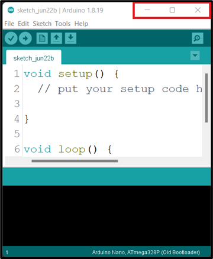

**Step 3:** Click the middle button "Maximize" in the top right corner of the window to maximize its size.

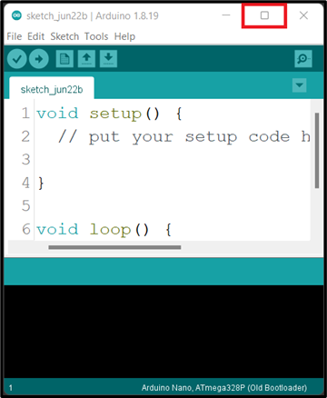.

At the point you should see the code below on your computer / laptop.

**Step 4:** Left Click before the ( void setup () ) and click on the Enter key on your keyboard to get space at the top of the void setup(). Then click above the void setup().

|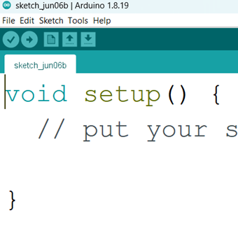 | 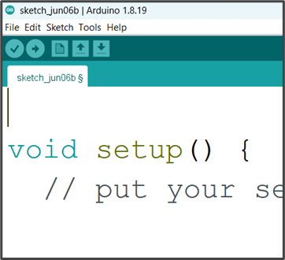 |
|----------------------------------|----------------------------------|

_**NB:** we will write the necessary code and comment at the space we created above the void setup ()._

## Comment
In programming, a comment is a piece of text that is added to the source code of a program to provide information or explanations. Comments are intended for human readers and are ignored by the compiler or interpreter when the program is executed.

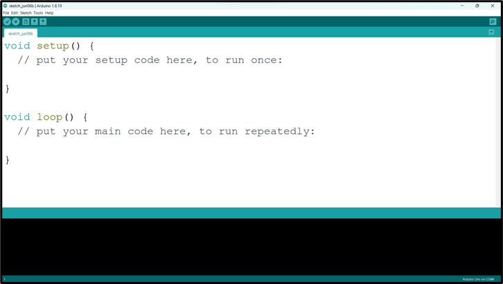.

_**NB:** before you type a comment, type two slash (//) before you complete your sentence._

 Selecting Arduino Board Type and Uploading your code

**Step 1:** Select the Board type. 
Click on tools on the menu bar hover your mouse on Board, a new window will appear. Look through and click on Arduino UNO.

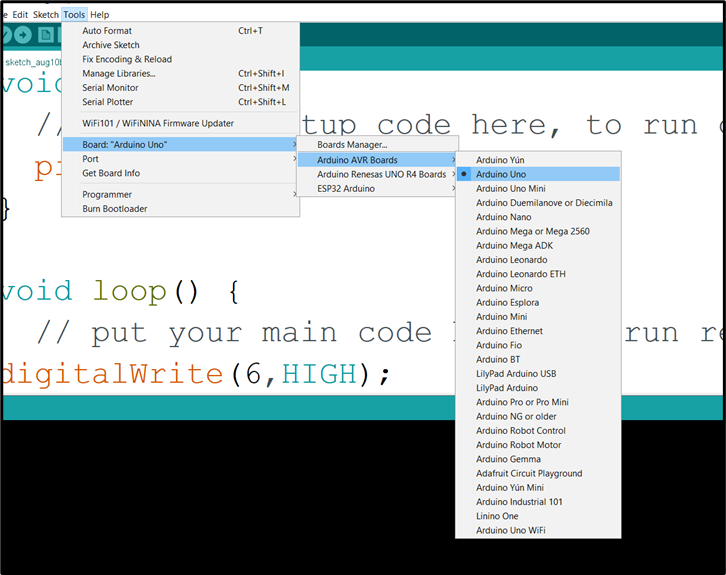.

**Step 2:** Select the Port.

Click on tools on the menu bar and hover your mouse on Port, a new window will appear. Look through and click on COM which has Arduino Uno  attached to it.

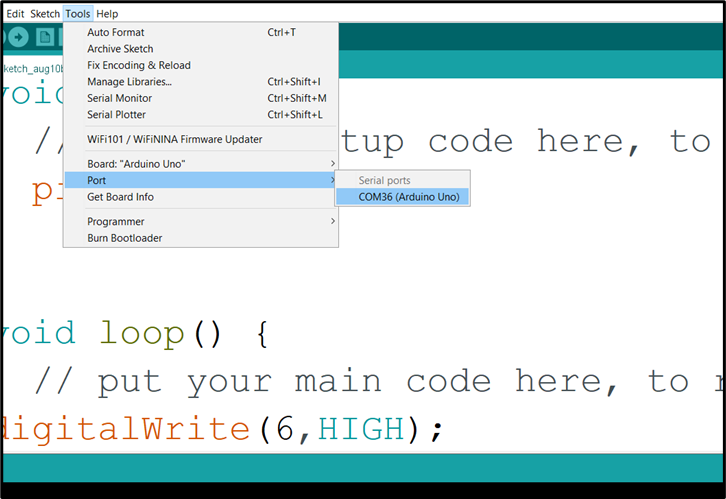.

_**NB:** Your COM number may be different. In this example we have COM36 (Arduino Uno)_

**Step 3:**  Click Control S (CTRL S) on your keyboard or click Save on the Arduino task bar.

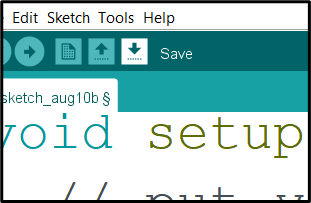.

A new window will pop up, type the project name and click save.

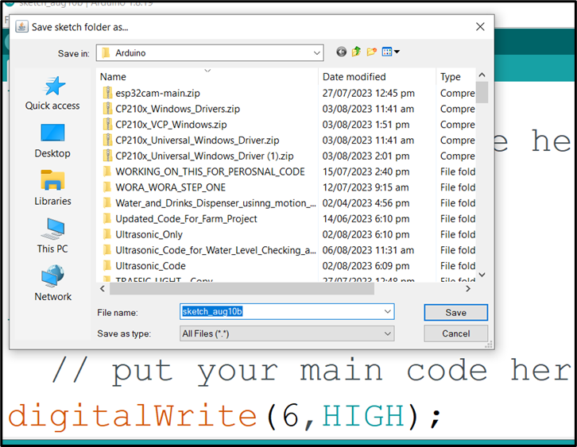.

**Step 4:** Click Verify. 

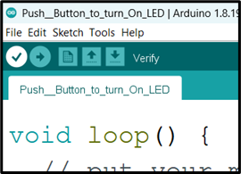.

**Step 5:** Click Upload. 

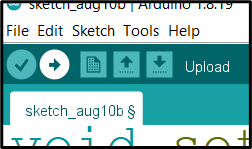.

_**NB:** Make sure there is no error in your code and the Arduino USB cable is connected to your laptop / desktop before you click **Upload**._

**WAIT TO SEE** _Done uploading_

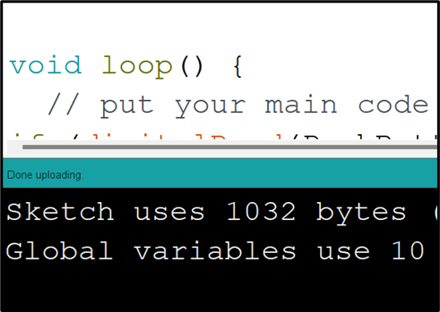.

# User Manual

## Manual 1.0

### 1.0 LED

- [Turn on one LED](docs/manuals/1.0/LED/1.LED_ON.md)
- [Blink one LED](docs/manuals/1.0/LED/1.1.One_LED_Blink.md)
- [Turn on two LEDs](docs/manuals/1.0/LED/2.LEDS_ON.md)
- [Blink two LEDs](docs/manuals/1.0/LED/2.1.Two_LED_Blink.md)

### 2.0 Buzzer

### 3.0 Push Button

### 4.0 Traffic Light Module

### 5.0 RGB Module

### 6.0 LDR Module

### 7.0 Servo Motor

### 8.0 Ultrasonic Sensor

### 9.0 Sound Sensor

## Manual 2.0

## Manual 3.0

## Project Ideas
## Community Forum