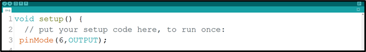
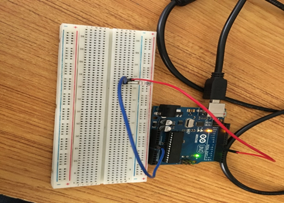
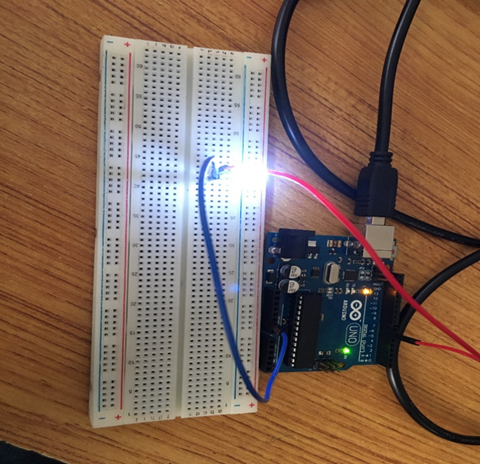

# Project 2: CAR TRAVIGATOR BLINKING

| **Description** | This project teaches how to program an LED to turn on and off within a time interval (Blink) without a human being having to turn on and off the switch. |
|------------------|----------------------------------------------------------------|
| **Use case**     | This knowledge forms the basis for home automation. It is also a steppingstone to controlling smart lights, leading to advanced lighting setups in modern smart homes. |

## Components (Things You will need)

|  |  |  |  ||
|-------------------------|-------------------------|-------------------------|-------------------------|-------------------------|

## Building the circuit

Things Needed:

-	Arduino Uno = 1
-	Arduino USB cable = 1
-	White LED = 1
-	Red jumper wires = 1
-	Blue jumper wires = 1


## Mounting the component on the breadboard

**Step 1:** Take the breadboard, the white LED and insert it into the vertical connectors on the breadboard.

.

_**NB:** Make sure you identify where the positive pin (+) and the negative pin (-) is connected to on the breadboard. The longer pin of the LED is the positive pin and the shorter one, the negative PIN_.

## WIRING THE CIRCUIT

### Things Needed:

- Red male-male-to-male jumper wires = 1
- Blue male-to-male jumper wires = 1


**Step 2:** Connect one end of red male-to-male jumper wire to the positive pin of the white LED on the breadboard and the other end to hole number 6 on the Arduino UNO.


**Step 3:** Connect one end of the blue male-to-male jumper to the negative pin of the white LED on the breadboard and the other end to GND on the Arduino UNO.

.

_make sure you connect the arduino usb blue cable to the Arduino board_.

.

_just as shown above, connect your USB cable to the Arduino board and to your laptop._

## PROGRAMMING

**Step 1:** Open your Arduino IDE. See how to set up here: [Getting Started](../../../../README.md#getting-started).

**Step 2:** Type ``` pinMode (6, OUTPUT);``` in the void Setup() function.

.

**Step 3:** Type the following codes in the void loop function as shown below;

   ```
   digitalWrite (6, HIGH);
   delay (1000);
   digitalWrite (6, LOW);
   delay (1000);
   ```
.

**Step 4:** Save your code. _See the [Getting Started](../../../../README.md#getting-started) section_

**Step 5:** Select the arduino board and port _See the [Getting Started](../../../../README.md#getting-started) section:Selecting Arduino Board Type and Uploading your code_.

**Step 6:** Upload your code. _See the [Getting Started](../../../../README.md#getting-started) section:Selecting Arduino Board Type and Uploading your code_

## OBSERVATION
|.|.|
|--------------------------------------------------|--------------------------------------------------|

## CONCLUSION
To sum up, the one LED blink project demonstrates a foundational concept in electronics and programming. Through this simple yet illuminating endeavor, learners grasp the essentials of hardware interfacing, coding logic, and timing control. This project lays the groundwork for more advanced explorations while showcasing the transformative power of just a single LED, sparking curiosity and creativity in the world of DIY electronics.
