# Project 3: DOUBLE LED ON

| **Description** | Double LED ON is a simple project that guides you in turning on two LEDs at the same time. |
|------------------|----------------------------------------------------------------|
| **Use case**     | This project finds utility in basic signaling setups. For instance, it could be applied in an easier and basic lighting system, where two LEDs turning on together provide ample brightness when someone enters a room. |

## Components (Things You will need)

| 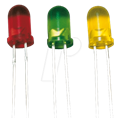 | 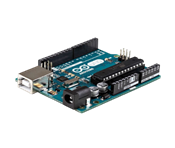 |  | 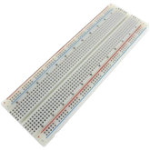 |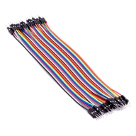|
|-------------------------|-------------------------|-------------------------|-------------------------|-------------------------|

## Building the circuit

Things Needed:

-	Arduino Uno = 1
-	Arduino USB cable = 1
-	White LED = 1
-	Red LED = 1
-	Red jumper wires = 1
-	Blue jumper wires = 1

## Mounting the component on the breadboard

## Mounting the component on the breadboard

**Step 1:** Take the breadboard, the white LED and insert it into the vertical connectors on the breadboard.

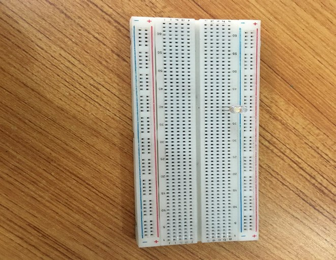.

_**NB:** Make sure you identify where the positive pin (+) and the negative pin (-) is connected to on the breadboard. The longer pin of the LED is the positive pin and the shorter one, the negative PIN_.

## WIRING THE CIRCUIT

### Things Needed:

- Red male-male-to-male jumper wires = 1
- Black male-to-male jumper wires = 1
- White male-to-male jumper wires = 1
- Blue male-to-male jumper wires = 1

**Step 2:** Connect one end of red male-to-male jumper wire to the positive pin of the white LED on the breadboard and the other end to hole number 6 on the Arduino UNO.

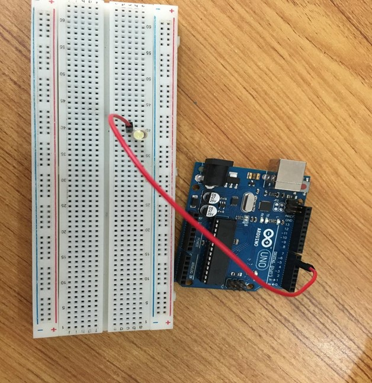.

**Step 3:** Connect one end of the blue male-to-male jumper to the negative pin of the white LED on the breadboard and the other end to GND on the Arduino UNO.

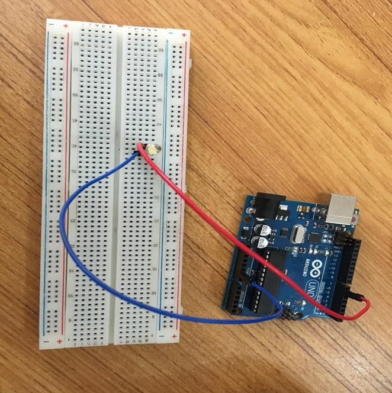.

**Step 4:** Take the red LED and insert it into the vertical connectors on the breadboard.

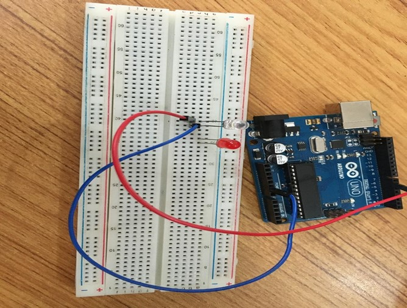.

**Step 5:** Connect one end of the black male-to-male jumper wire to the positive pin of the red LED on the breadboard and the other end to hole number 5 on the Arduino UNO.

**Step 6:** Connect one end of the black male-to-male jumper wire to the positive pin of the red LED on the breadboard and the other end to hole number 5 on the Arduino UNO.

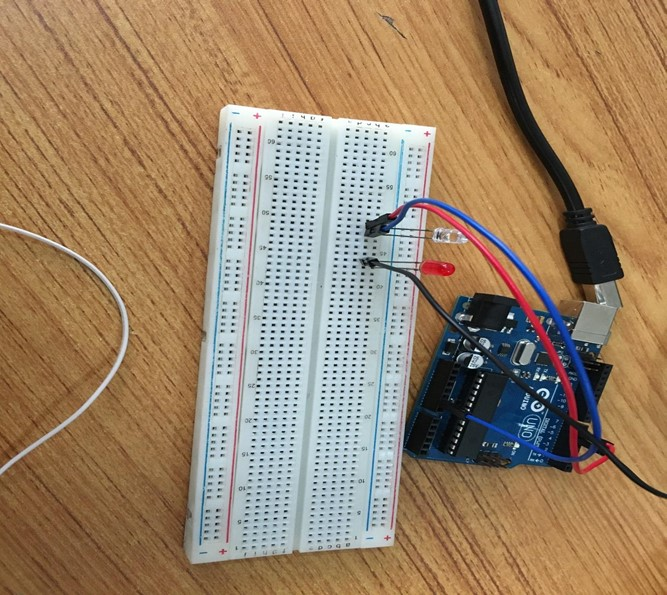.

**Step 7:** Connect one end of the white male-to-male jumper wire to the negative pin of the white LED on the breadboard and the other end to GND on the Arduino UNO.

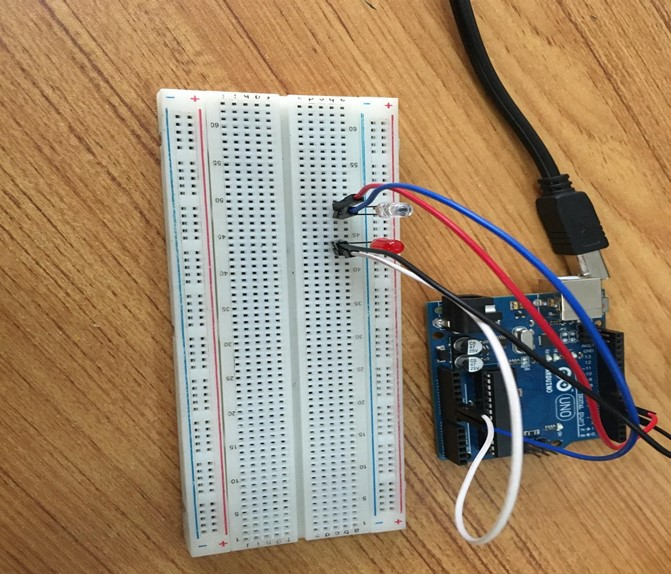.

_make sure you connect the arduino usb use blue cable to the Arduino board_.

## PROGRAMMING

**Step 1:** Open your Arduino IDE. See how to set up here: [Getting Started](../../../../README.md#getting-started).

**Step 2:** Type the following codes in the void setup function as shown in the image below.
   ```
   pinMode (6, OUTPUT);
   pinMode (5, OUTPUT);
   ```

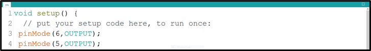.

**Step 3:** Type the following code in the void loop function as shown below in the image below.
   ```
   digitalWrite (6, HIGH);
   digitalWrite (5, HIGH);
   ```

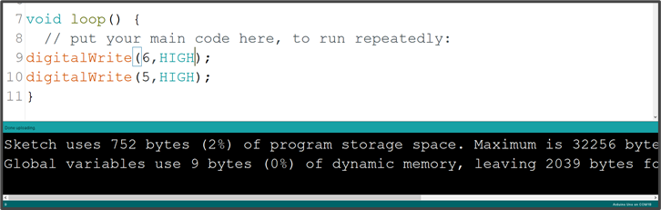.

_**NB:** pinMode will help the Arduino board to decide which port should be activated. The code below will turn off the two light bulbs._

**Step 4:** Save your code. _See the [Getting Started](../../../../README.md#getting-started) section_

**Step 5:** Select the arduino board and port _See the [Getting Started](../../../../README.md#getting-started) section:Selecting Arduino Board Type and Uploading your code_.

**Step 6:** Upload your code. _See the [Getting Started](../../../../README.md#getting-started) section:Selecting Arduino Board Type and Uploading your code_

## OBSERVATION

.

## CONCLUSION

In summary, the two-LED project presents a basic yet significant step in understanding parallel LED control. By simultaneously lighting up two LEDs, learners gain insight into simple circuit connections and programming synchronization. This project serves as a starting point for more complex configurations while highlighting the fundamental principle of coordinated electronic actions, setting the stage for broader exploration in electronics and automation.