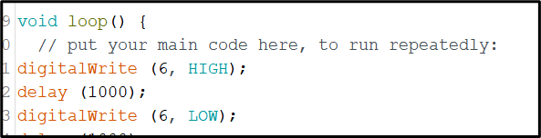
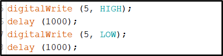
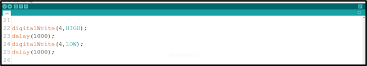
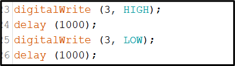
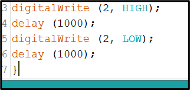

# Project 21: SPECIAL LED

| **Description** | This is a project that’ll teach you how to program three (3) LEDs but only one will turn on where the others all stay off. |
|------------------|----------------------------------------------------------------|
| **Use case**     | In the situation where you want only the light in your bedroom to turn on while the lights in the sitting room and corridor to stay off, you can use this approach. |

## Components (Things You will need)

|  |  |  |  ||
|-------------------------|-------------------------|-------------------------|-------------------------|-------------------------|-------------------------|

## Building the circuit

Things Needed:

-	Arduino Uno Board = 1
-	Arduino USB cable = 1
-	RGB= 1
-	Red jumper wires = 1
-	Green jumper wires = 1
-	Brown jumper wires = 1
-	Blue jumper wires = 1

## Mounting the component on the breadboard

**Step 1:** The RGB module has four pins, R pin(red), G pin(green), B pin(blue) and – pin (GND). On the middle section of the breadboard, locate each horizontal section lettered A to J. Take the RGB module and insert it into any of the lettered section (Say A) horizontally. 
_**NB:** Take note of where each of the pins of the RGB are placed on the bread board._


.


## WIRING THE CIRCUIT

Things Needed:

-	Red jumper wires = 1
-	Green jumper wires = 1
-	Brown jumper wires = 1
-	Blue jumper wires = 1


**Step 2:** Take the Red male-to-male jumper wire and connect one end to the R pin of the RGB module and the other end to digital pin number 2 on the Arduino uno board.

.

**Step 3:** Take the Green male-to-male jumper wire and connect one end to the G pin of the RGB module and the other end to digital pin number 7 on the Arduino uno board.

.

**Step 4:** Take the Blue male-to-male jumper wire and connect one end to the B pin of the RGB module and the other end to digital pin number 10 on the Arduino uno board.

.

**Step 5:** Take the Brown male-to-male jumper wire and connect one end to the - pin of the RGB module and the other end to GND on the Arduino uno board.

.

_**NB:** Connect the USB port of the Arduino cable to the USB port of your laptop and the other side of the Arduino cable to the Arduino Uno Board._


## PROGRAMMING

**Step 1:** Open your Arduino IDE. See how to set up here: [Getting Started](../../../../README.md#getting-started).

**Step 2:** Type the following codes in the void setup function as shown in the image below.
   
   ```
   pinMode(6,OUTPUT);
   pinMode(5,OUTPUT);
   pinMode(4,OUTPUT);
   pinMode(3,OUTPUT);
   pinMode(2,OUTPUT);
   ```

.

_**NB:** pinMode will help the Arduino board to decide which port should be activated.  The code below will turn off the three light bulbs._

**Step 3:** Type the following codes in the void loop function.as shown in the image below;
   ```
   digitalWrite (6, HIGH);
   delay (1000);
   digitalWrite (6, LOW);
   delay (1000);
   ```
.

**Step 4:** let continue by ting the following codes;
   ```
   digitalWrite (5, HIGH);
   delay (1000);
   digitalWrite (5, LOW);
   delay (1000);
   ```
.

**Step 5:** let continue by ting the following codes;
   ```
   digitalWrite (4, HIGH);
   delay (1000);
   digitalWrite (4, LOW);
   delay (1000);

   ```
.

**Step 6:** let continue by ting the following codes;
   ```
   digitalWrite (3, HIGH);
   delay (1000);
   digitalWrite (3, LOW);
   delay (1000);
   ```
.

**Step 7:** let finish by ting the following codes;
   ```
   digitalWrite (2, HIGH);
   delay (1000);
   digitalWrite (2, LOW);
   delay (1000);
   ```
.


**Step 5:** Save your code. _See the [Getting Started](../../../../README.md#getting-started) section_

**Step 6:** Select the arduino board and port _See the [Getting Started](../../../../README.md#getting-started) section:Selecting Arduino Board Type and Uploading your code_.

**Step 7:** Upload your code. _See the [Getting Started](../../../../README.md#getting-started) section:Selecting Arduino Board Type and Uploading your code_

## CONCLUSION

In a nutshell, the project centered around five blinking LEDs offers hands-on experience in synchronized LED control. By creating a blinking pattern across all five LEDs, participants gain insights into circuit connections, loop-based programming, and coordinated timing. This endeavor serves as a stepping stone for more advanced electronics projects, highlighting the concept of repetitive actions and sparking interest in practical electronics applications.
