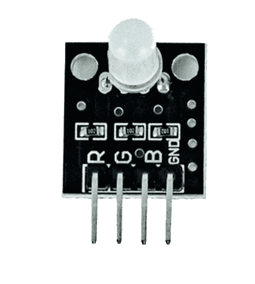
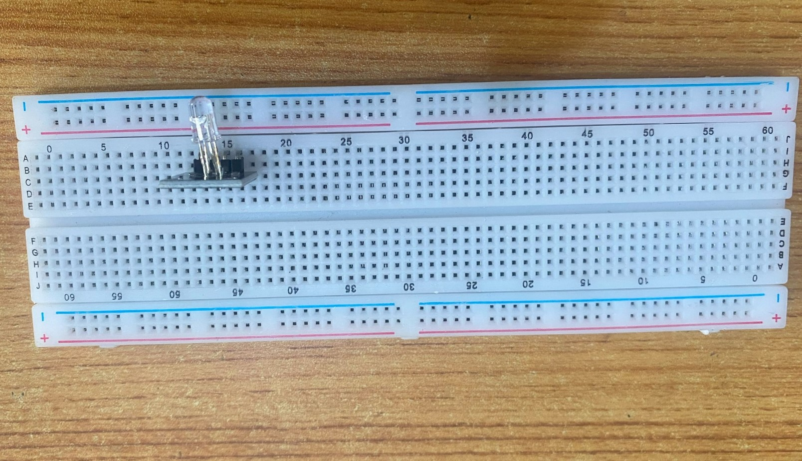
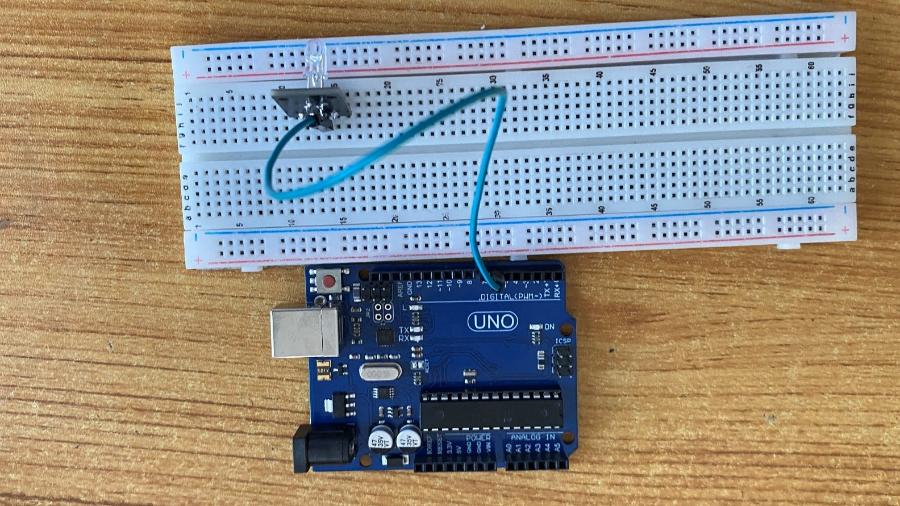
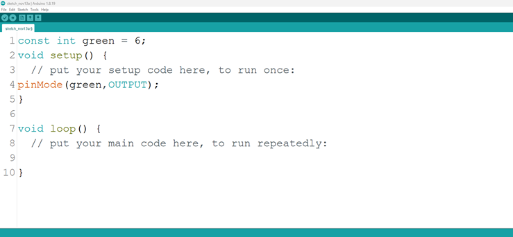
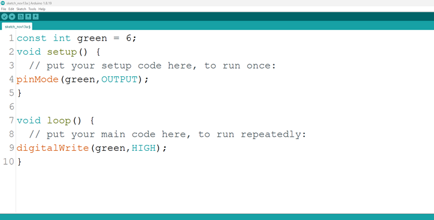
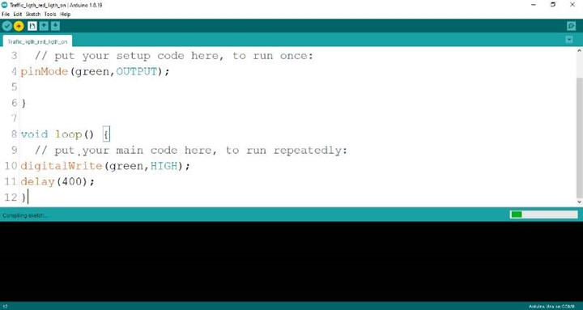
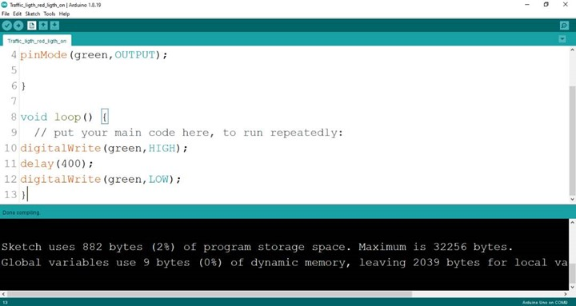
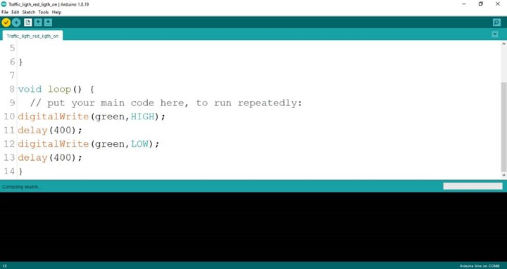

# Project 24: Only Green Blink

| **Description** | This project is one that makes emphasis on how to create a simple circuit and to control the green light on the RGB to blink beautifully. |
|------------------|----------------------------------------------------------------|
| **Use case**     | Wanting to create a lighting system for your game pad to blink a nice and beautiful green light, you can program the green LED in the RGB alone to blink making the game pad much attractive to play with. |

## Components (Things You will need)

|  |  |  |  ||
|-------------------------|-------------------------|-------------------------|-------------------------|-------------------------|-------------------------|

## Building the circuit

Things Needed:

-	Arduino Uno Board = 1
-	Arduino USB cable = 1
-	RGB= 1
-	Green jumper wires = 1
-	White jumper wires = 1

## Mounting the component on the breadboard

**Step 1:** The RGB module has four pins, R pin(red), G pin(green), B pin(blue) and – pin (GND). On the middle section of the breadboard, locate each horizontal section lettered A to J. Take the RGB module and insert it into any of the lettered section (Say A) horizontally. 

 _**NB:** Take note of where each of the pins of the RGB are placed on the bread board._


.


## WIRING THE CIRCUIT

Things Needed:

-	Red jumper wire = 1
-	white jumper wire = 1

**Step 2:** Take the green jumper wire. This wire will connect the Arduino UNO and the G pin of the RGB module. 

- Connect one end of the green jumper wire to G pin of RGB module on the breadboard. Ensure you put the pin in the right hole.

- Connect the other end of the green jumper wire to pin number 6 on the Arduino UNO.


.

**Step 3:** Take the white jumper wire and connect one end to the GND or the - pin of the RGB module.

- Connect the other end of the white jumper wire to GND on the Arduino UNO.


.

## PROGRAMMING

**Step 1:** Open your Arduino IDE. See how to set up here: [Getting Started](../../../../README.md#getting-started).

**Step 2:** Type ```const int red = 6;``` as shown below in the image.

_**NB:** Make sure you avoid errors when typing. Do not omit any character or symbol especially the bracket { }  and semicolons ;  and put them as you see in the image. The code that comes after the two ash backslashes “//” are called comments. They are not part of the code that will be run, they only explain the lines of code. You can avoid typing them._

.

**Step 3:** Type ```pinMode (green, OUTPUT);``` as shown below in the image.

.

_**NB:** The code below sets the pin names “green” as an output pin. An output pin helps send signals from the microcontroller to other components in the circuit. The pinMode () function, helps determine and control the behavior of a specific pin on the board_

**Step 4:** Type ```digitalWrite (green, HIGH);``` as shown below in the image.

.

The digitalWrite () function controls the state of the pin. The pin can either be HIGH or LOW. The HIGH state turns on the LED. As a result, the code below turns on the LED.

**Step 5:** Type  ```delay (400);``` as shown below 

.

**Step 6:** Type ```digitalWrite (green, LOW);``` as seen below:

.

**Step 7:** Type ```delay (400);``` as shown below.

.

**Step 8:** Save your code. _See the [Getting Started](../../../../README.md#getting-started) section_

**Step 9:** Select the arduino board and port _See the [Getting Started](../../../../README.md#getting-started) section:Selecting Arduino Board Type and Uploading your code_.

**Step 10:** Upload your code. _See the [Getting Started](../../../../README.md#getting-started) section:Selecting Arduino Board Type and Uploading your code_

## CONCLUSION

In brief, the project centered on creating a blinking green light within an RGB configuration offers a captivating insight into color manipulation and electronic control. By programming the green LED component to blink, participants gain understanding in timing control, code logic, and the dynamic visual effects of a single color. This endeavor marks an important milestone in exploring RGB color variation, showcasing the rhythmic potential of individual color components, and igniting curiosity in practical applications such as animated lighting displays and creative visual presentations.