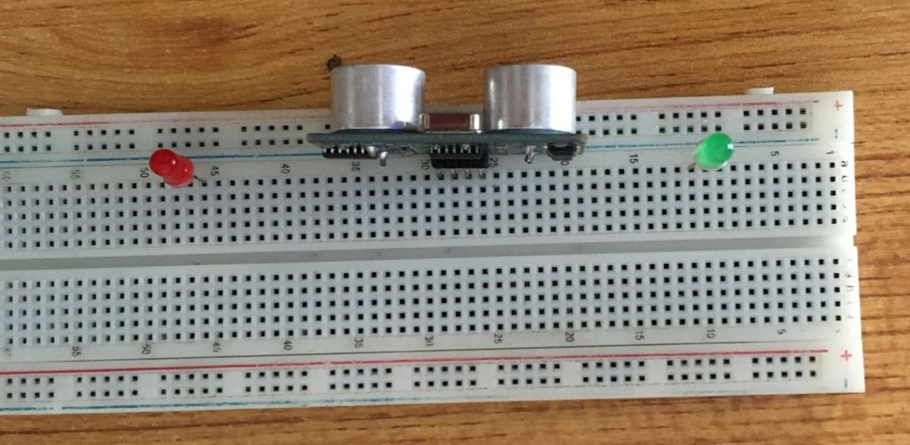
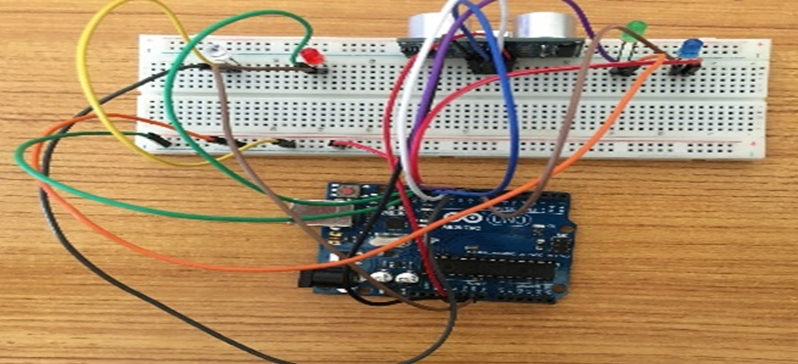
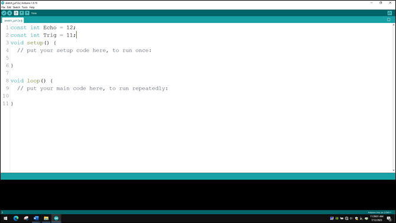
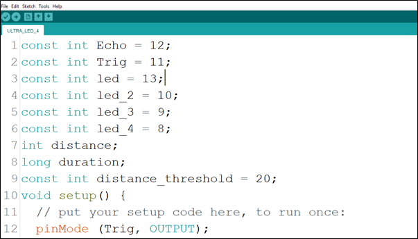
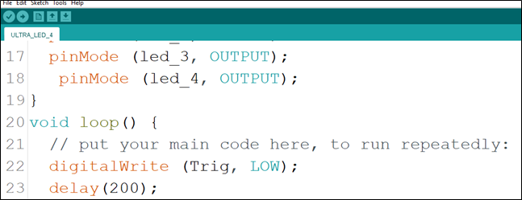

# Project 2.004: SMART ALERT LIGHTINING SYSTEM 

| **Description** | This smart lighting system illustrate the potential of using Arduino, LEDs and ultrasonic sensor in infrastructure and street light planning. |
|------------------|----------------------------------------------------------------|
| **Use case**     | Implementing a lightening system that include different LEDs with adaptable colours to suit ones mood.  |

## Components (Things You will need)

|  |  |  |  || |
|-------------------------|-------------------------|-------------------------|-------------------------|-------------------------|-------------------------|

## Building the circuit

Things Needed:

-	1 Arduino Uno Board 
-	1 Arduino USB Cable 
-	1 Breadboard 
-	13 Jumper Wire 
-	1 Red LED 
-	1 Green LED 
-	1 White LED 
-	1 Blue LED 
-	1 Ultrasonic Sensor 

## Mounting the component on the breadboard

### Things needed:

-	1 Ultrasonic Sensor 
-	1 Breadboard 
-	1 Red LED 
-	1 White LED 
-	1 Blue LED
-	Green LED 

**Step 1:** Take the breadboard and the ultrasonic sensor. Insert the ultrasonic sensor into the horizontal connectors on the breadboard, with the pins facing outwards as shown in the picture below

.

**Step 2:** Insert the red LED into the horizontal connectors on the breadboard beside the ultrasonic sensor and take note of where the positive pin (long pin) is and where the negative pin (short pin) is as shown in the picture below.

.

**Step 3:** Insert the green LED into the horizontal connectors on the breadboard on the other side of the ultrasonic sensor and take note of where the positive pin (long pin) is and where the negative pin (short pin) is as shown in the picture below.

.

**Step 4:** Insert the White LED into the horizontal connectors on the breadboard and take note of where the positive pin (long pin) is and where the negative pin (short pin) is as shown in the picture below.

.

**Step 5:** Connect one end of the brown male-to-male jumper wire to the negative pin of the Blue LED and the other end to digital pin 8 on the Arduino Uno board as shown in the picture below.

.

## WIRING THE CIRCUIT

### Things Needed:

-	2 Red male-to-male jumper wire 
-	1 Black male-to-male jumper wire 
-	1 White male-to-male jumper wire 
-	1 Blue male-to-male jumper wire 
-	2 Brown male-to-male jumper wire 
-	2 Green male-to-male Jumper Wire
-	1 Violet male-to-male Jumper Wire 
-	1 Orange male-to-male Jumper Wire 
-	1 Yellow male-to-male Jumper Wire
-	1 Grey male-to-male Jumper Wire 

**Step 1:** Connect one end of the red male-to-male jumper wire to the VCC pin of the Ultrasonic sensor and the other end to the 5V pin on the Arduino Uno board as shown in the picture below.


**Step 2:** Connect one end of the black male-to-male jumper wire to the GND pin of the Ultrasonic sensor and the other end to the GND pin on the Arduino Uno board as shown in the picture below.

.

**Step 3:** Connect one end of the white male-to-male jumper wire to the Trig pin of the Ultrasonic sensor and the other end to digital pin 11 on the Arduino Uno board as shown in the picture below.

.

**Step 4:** Connect one end of the Blue male-to-male jumper wire to the Echo pin of the Ultrasonic sensor and the other end to digital pin 12 on the Arduino Uno board as shown in the picture below.

.

**Step 5:** Connect one end of the brown male-to-male jumper wire to the negative pin of the LED and the other end to digital pin GND on the Arduino Uno board as shown in the picture below.

.

**Step 6:** Connect one end of the green male-to-male jumper wire to the positive pin of the LED and the other end to pin 13 on the Arduino Uno board as shown in the picture below.

.

**Step 7:** Connect one end of the green male-to-male jumper wire to the GND of the Arduino Uno board and the other end to the negative section of the Breadboard to power the whole negative section as shown in the picture below.

.

**Step 8:** Connect one end of the violet male-to-male jumper wire to the positive pin of the LED and the other end to pin 10 on the Arduino Uno board as shown in the picture below.

.

**Step 9:** Connect one end of the orange male-to-male jumper wire to the negative pin of the green LED and the other end to the line of holes labelled negative on the breadboard as shown in the picture below.

.

**Step 10:** Connect one end of the gray male-to-male jumper wire to the positive pin of the white LED and the other end to digital pin 9 on the Arduino Uno board as shown in the picture below.

.

**Step 11:** Connect one end of the yellow male-to-male jumper wire to the negative pin of the white LED and the other end to the port next to the orange male-to-male jumper wire on the breadboard to connect to the GND as shown in the picture below.

.

**Step 12:** Connect one end of the Brown male-to-male jumper wire to the positive pin of the Blue LED and the other end to digital pin 8 on the Arduino Uno board as shown in the picture below.

.

**Step 13:** Connect one end of the Red male-to-male jumper wire to the negative pin of the Blue LED and the other end to the negative section on the Breadboard where the GND runs through as shown in the picture below.

.

## PROGRAMMING

**Step 1:** Open your Arduino IDE. See how to set up here: [Getting Started](../../../../README.md#getting-started).

**Step 2:** ```const int Echo = 12;``` to define the Echo pin.

.

_**NB:** Make sure you avoid errors when typing. Do not omit any character or symbol especially the bracket {} and semicolons; and place them as you see in the image. The code that comes after the two ash backslashes “//” are called comments. They are not part of the code that will be run, they only explain the lines of code. You can avoid typing them._

**Step 3:** Type ```const int Trig = 11;``` to define the Trig pin.

.

**Step 4:** Press ENTER to go to the next line, type ```const int led = 13;``` to define the pin for the led

.

**Step 5:** Press ENTER to go to the next line, type ```const int led_2 = 10;``` to define the second pin for the led

.

**Step 6:** Press ENTER to go to the next line, type ```const int led_3 = 9;``` to define the third pin for the led

.

**Step 7:** Press ENTER to go to the next line, type ```const int led_4 = 8;``` to define the fourth pin for the led

.

**Step 8:** Press ENTER to go to the next line, type ``` int distance;``` to declare the distance variable.

.

**Step 9:** Type ```long duration;``` to declare the duration variable.

.

**Step 10:** Type ```const int distance_threshold = 20;``` to declare the distance threshold variable.

.

**Step 11:** Inside the curly brackets of the void setup () function, type ```pinMode(Trig, OUTPUT);``` to set the Trig pin as an output.

.

**Step 12:** Type ```pinMode(Echo, INPUT);``` to set the Echo pin as an input.

.

**Step 13:** Type ```Serial.begin (9600);``` As shown in the picture below. This is to activate the serial monitor.

.

**Step 14:** Type ```pinMode(led, OUTPUT);``` As shown in the picture below.

.

**Step 15:** Type ```pinMode(led_2, OUTPUT);``` As shown in the picture below.

.

**Step 16:** Type ```pinMode(led_3, OUTPUT);``` As shown in the picture below.

.

**Step 17:** Type ```pinMode(led_4, OUTPUT);``` As shown in the picture below.

.

**Step 18:** Inside the curly brackets of the void loop (), which is where you put your code to run repeatedly. Type ```digitalWrite(Trig, LOW);``` As shown in the picture below.

.

**Step 19:** Type ```delay (200);``` to introduce a delay.

.

**Step 20:** Type the following code to turn ON the ultrasonic sensor. As shown in the picture below.
   ```
   digitalWrite (Trig, HIGH);
   delay (100); //to introduce a delay. 
   ```
.

**Step 21:** Type ```digitalWrite (Trig, LOW);``` to turn off the ultrasonic sensor. As shown in the picture below to turn OFF the ultrasonic sensor.

.

**Step 22:** Type the following code
   ```
   duration = pulseIn (Echo, HIGH); // to read the duration from the Echo pin. As shown in the picture below.
   //This is to take input from the Echo pin.

   distance = duration * 0.034 / 2; // to calculate the distance. As shown in the picture below.
   ```

.

**Step 23:** Type the conditional statement to turn on the LED at a distance less than the threshold distance.
   ```
   if (distance < distance_threshold){
      digitalWrite (led, HIGH);
      digitalWrite (led_2, HIGH);
      digitalWrite (led_3, HIGH);
      digitalWrite (led_4, HIGH);
   }
   ```
.

**Step 24:** Type 
   ```
   else{
      digitalWrite (led, LOW);
      digitalWrite (led_2, LOW);
      digitalWrite (led_3, LOW);
      digitalWrite (led_4, LOW);
   }
   ```

.

**Step 25:** Type the following code to print the distance value to the serial monitor.  As shown in the picture below.

   ```
   Serial.print (distance); //This code allows the serial monitor to print the values for distance.
   Serial.println (“cm”); //Here a unit is given to the distance values.
   delay (100);
   ```

.


**Step 26:** Save your code. _See the [Getting Started](../../../../README.md#getting-started) section_

**Step 27:** Select the arduino board and port _See the [Getting Started](../../../../README.md#getting-started) section:Selecting Arduino Board Type and Uploading your code_.

**Step 28:** Upload your code. _See the [Getting Started](../../../../README.md#getting-started) section:Selecting Arduino Board Type and Uploading your code_

## OBSERVATION

**Step 1:** Click on the serial monitor icon to view the distances being recorded as shown in the picture below.

.

**Step 2:** Put an object or your hand in front of the ultrasonic sensor and keep moving it away or closer to see the changes in the distances on the serial monitor and the LED turning ON and OFF as per the distances. As shown in the pictures below.

.

.

## CONCLUSION
If you encounter any problems when trying to upload your code to the board, run through your code again to check for any errors or missing lines of code. If you did not encounter any problems and the program ran as expected, Congratulations on a job well done.   
