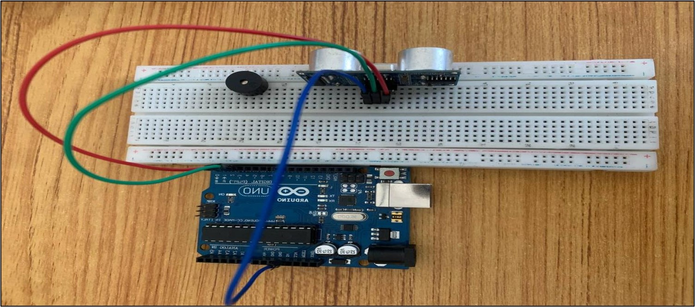

# Project 2.006: SMART SOUND ALERT SYSTEM 

| **Description** | This smart sound alert system illustrate the potential of using Arduino, buzzer and ultrasonic sensor in building a security system. |
|------------------|----------------------------------------------------------------|
| **Use case**     | Creating a smart alarm system.  |

## Components (Things You will need)

|  |  |  |  || |
|-------------------------|-------------------------|-------------------------|-------------------------|-------------------------|-------------------------|

## Building the circuit

Things Needed:

-	1 Arduino Uno 
-	1 Arduino USB cable 
-	1 Buzzer
-	1 Breadboard 
-	6 Jumper wires

## Mounting the component on the breadboard

### Things needed:

-	1 Buzzer 
-	1 Ultrasonic Distance Sensor 
-	1 Breadboard 

**Step 1:** The ultrasonic distance sensor has four pins (Echo, Trig, VCC and GND), On the middle section of the breadboard, locate each horizontal section lettered A to J. Take the ultrasonic distance sensor and insert it into any of the lettered section (Say A) horizontally.

.

**Step 2:** The Buzzer has Two pins (Positive and Negative). The longer pin is positive and the shorter pin is negative. On the middle section of the breadboard, locate each horizontal section lettered A to J. Take the Buzzer and insert it into any of the lettered section (Say A) horizontally. 

.

_NOTE: Take note of where each of the pins are placed on the bread board._

## WIRING THE CIRCUIT

### Things Needed:

-	2 Red male-male-to-male jumper wires 
-	2 White male-to-male jumper wires 
-	2 Green male-to-male jumper wires 
-	2 Yellow male-to-male jumper wires 

**Step 1:** Take the Red male-male-to-male jumper wire and place one side of the wire pin under the Echo pin of the ultrasonic distance sensor and the other side of the wire pin to the digital pin 2 on the Arduino uno board.

.

**Step 2:** Take the Green male-male-to-male jumper wire and place one side of the wire pin under the Trig pin of the ultrasonic distance sensor and the other side of the wire pin to the digital pin 3 on the Arduino uno board.

.

**Step 3:** Take the Blue male-male-to-male jumper wire and place one side of the wire pin under the VCC pin of the ultrasonic distance sensor and the other side of the wire pin to the 5V pin on the Arduino uno board.

.

**Step 4:** Finally, Take the White male-male-to-male jumper wire and place one side of the wire pin under the GND pin of the ultrasonic distance sensor and the other side of the wire pin to the GND port on the Arduino Uno Board.

.

**Step 5:** Take the Red male-male-to-male jumper wire and place one side of the wire pin under the Positive pin of the Buzzer and the other side of the wire pin to the digital pin 4 on the Arduino uno board.

.

**Step 6:** Take the White male-male-to-male jumper wire and place one side of the wire pin under the Negative pin of the Buzzer and the other side of the wire pin to GND on the Arduino uno board.

.

**Step 7:** Connect the USB port of the Arduino cable to the USB port of your laptop and the other side to the Arduino Uno Board.

.

## PROGRAMMING

**Step 1:** Open your Arduino IDE. See how to set up here: [Getting Started](../../../../README.md#getting-started).

**Step 2:** Type ```const int Echo = 2;``` as shown in the picture below.

.

**Step 3:** Type ```int Trig = 3;``` as shown in the picture below.

.

**Step 4:** Type ```int B = 4;``` as shown in the picture below.

.

**Step 5:** Type 
    ```
    long duration;
    int distance;
    ``` 
    as shown in the picture below.

.

**Step 6:** Type ```const int dist_threshold = 20;``` as shown in the picture below.

.

**Step 7:** After the (void setup ()) within the curly brackets type 
    ```
    pinMode (Echo, INTPUT); 
    pinMode (Trig, OUTPUT); 
    Serial.begin (9600);
    pinMode (B, OUTPUT);
    ``` 

.

**Step 8:** After the (void loop ()) within the curly brackets type 
    ```
    digitalWrite (Trig, LOW); 
    delay (200);
    digitalWrite (Trig, HIGH); 
    delay (100);
    digitalWrite (Trig, LOW); 
    duration = pulseIn (Echo, HIGH);
    distance = duration * 0.034/2;
    ``` 

.

**Step 9:** Type Function
    ```
    if (distance < dist_threshold)
    {
        digitalWrite (B, HIGH); 
        delay (200);
        digitalWrite (B, LOW); 
        Serial.print (distance);
        Serial.println (“cm”);
        delay (100);
        distance = duration * 0.034/2;
    }
    ``` 

.

**Step 10:** Save your code. _See the [Getting Started](../../../../README.md#getting-started) section_

**Step 11:** Select the arduino board and port _See the [Getting Started](../../../../README.md#getting-started) section:Selecting Arduino Board Type and Uploading your code_.

**Step 12:** Upload your code. _See the [Getting Started](../../../../README.md#getting-started) section:Selecting Arduino Board Type and Uploading your code_

## CONCLUSION

If you encounter any problems when trying to upload your code to the board, run through your code again to check for any errors or missing lines of code. If you did not encounter any problems and the program ran as expected, Congratulations on a job well done.