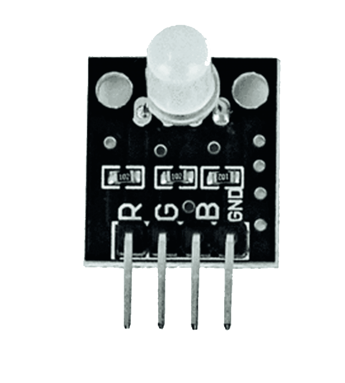

# Project 2:STEMAIDE Pushbutton And RGB Control 

| **Description** | You will learn how to create a simple circuit using a microcontroller, RGB module and a Pushbutton. |
|------------------|----------------------------------------------------------------|
| **Use case**     | Imagine you want to use a sensor to on an LED of different color in your room after you press a pushbutton using Arduino.  |

## Components (Things You will need)

|  |  |  |  ||  |
|-------------------------|-------------------------|-------------------------|-------------------------|-------------------------|-------------------------|

## Building the circuit

Things Needed:
-	Arduino Uno = 1
-	Arduino USB cable = 1
-	RGB module= 1
-	Breadboard = 1
-	Pushbutton = 1
-	Black male- male jumper wire = 1
-	White male- male jumper wire = 1
-	Red male- male jumper wire = 2
-	Blue male- male jumper wire = 1
-	Green male- male jumper wire = 1


## Mounting the component on the breadboard
Things Needed:

-  Pushbutton = 1
-  Breadboard =1
-  RGB Module = 1


**Step 1:** 
-	The push button has four unassigned pins.
-	On the middle section of the breadboard, locate each horizontal section lettered A to J.
-	Take the push button and insert two pins into the lettered section ‘g’ horizontally.
-	Insert the other two pins into the lettered section ‘d’ horizontally.


.


**Step 2:** 
-	The RGB module has Four pins (Red, Green, Blue and Negative). These pins are labelled on the component
-	On the middle section of the breadboard, locate each horizontal section lettered A to J.
-	Take the RGB module and insert it into any of the lettered section (Say A) horizontally


.


## WIRING THE CIRCUIT

### Things Needed:

-	Black male- male jumper wire = 1
-	White male- male jumper wire = 1
-	Red male- male jumper wire = 2
-	Blue male- male jumper wire = 1
-	Green male- male jumper wire = 1
-	Arduino Uno Board = 1


**Step 3:**  Take the Red male-male-to-male jumper wire and place one side of the wire pin under the push button pin located on the lettered section ‘d’ and the other side of the wire pin to the digital pin 2 on the Arduino uno board.
.


**Step 4:**  Take the White male-male-to-male jumper wire and place one side of the wire pin under the other pin located on the lettered section ‘d’ and the other side of the wire pin to GND on the Arduino uno board. 

.

**Step 5:**  Take the Black male-to-male jumper wire and place one side of the wire pin under the negative pin of the RGB module and the other side of the wire pin to GND on the Arduino Uno board.

.

**Step 6:**  Take the Red male-to-male jumper wire and place one side of the wire pin under the Red pin of the RGB module and the other side of the wire pin to digital pin 3 on the Arduino Uno board.


.

**Step 7:**  Take the Green male-to-male jumper wire and place one side of the wire pin under the Green pin of the RGB module and the other side of the wire pin to the digital pin 4 on the Arduino Uno board. 


.

**Step 8:**  Take the Blue male-to-male jumper wire and place one side of the wire pin under the G pin of the RGB module and the other side of the wire pin to the digital pin 5 on the Arduino Uno board.


.


## Connecting The Arduino Uno Board To Your Laptop.

Arduino Uno Board
Arduino cable

**Step 7:**	 Connect the USB port of the Arduino cable to the USB port of your laptop and the other side to the Arduino Uno Board.


.


## PROGRAMMING

**Step 1:** Open your Arduino IDE. See how to set up here: [Getting Started](../../../../README.md#getting-started).


**Step 2:** Type ``` const int buttonPin = 2;``` as shown in the picture below.

.

**Step 3:** Type ```int red = 3;``` as shown in the picture below. 

.

**Step 4:** Press ENTER to go to the next line, type ```int green = 4;``` to define the green pin as shown in the picture below. 

.

**Step 5:** Type ```int blue = 3;```to define the pin for the blue pin as shown in the picture below. 

.

**Step 6:** Type ```int buttonState = 0;``` as shown in the picture below. 

.

**Step 7:** Type ```int currentColor = 0;```to declare the current color state as shown in the picture below. 

.

**Step 8:** Type Inside the curly brackets of the void setup () function, type ```pinMode (buttonPin, INPUT_PULLUP);``` to set the button pin as an input. 

.


**Step 9:** After the (void setup ()) within the curly brackets type
``` 
pinMode (red, OUTPUT); 
pinMode (green, OUTPUT);
pinMode (blue, OUTPUT); to set the RGB pins as an output.

```
.

**Step 10:** Inside the curly brackets of the void loop (), which is where you put your code to run repeatedly. Type  As shown in the picture below. 
```
buttonState = digitalRead (buttonPin);
```
 As shown in the picture below. 


.

**Step 11:**  Type
```
(buttonState = LOW);
  currentColor++; 

```
As shown in the picture below. 

.


**Step 12:**  Type
```
currentColor = currentColour % 4; 

```
As shown in the picture below. 

.

**Step 13:**  Type
```
setColour (currentColor); 
    delay (200);  

```
As shown in the picture below. 

.

**Step 14:**  Type a function
 ```
void setColor (int color){

```
to set the RGB LED colors. As shown in the picture below. 

.

**Step 15:** Type Function
```
digitalWrite (red, LOW); 
digitalWrite (green, LOW);
digitalWrite (blue, LOW); 
} 
```
to turn off all colors first. As shown in the picture below.


.

**Step 16:** Type the conditional statement to set the RGB color based on the current color.
```
if (color == 1) {
    digitalWrite (red, HIGH); 
}
```
As shown in the picture below.


.


**Step 17:** Type the alternative for the conditional statement to set the RGB color based on the current color.
```
else if (color == 2) {
    digitalWrite (green, HIGH); 
}
```
As shown in the picture below.


.

**Step 18:** Type the alternative for the conditional statement to set the RGB color based on the current color.
```
else if (color == 3) {
    digitalWrite (blue, HIGH); 
}
```
As shown in the picture below.


.


**Step 19:** Type the alternative for the conditional statement to set the RGB color based on the current color.
```
else if (color == 0) {
    digitalWrite (red, LOW); 
     digitalWrite (green, LOW); 
  digitalWrite (blue, LOW); 
}
```
As shown in the picture below.


.


**Step 20:** Save your code. _See the [Getting Started](../../../../README.md#getting-started) section_

**Step 21:** Select the arduino board and port _See the [Getting Started](../../../../README.md#getting-started) section:Selecting Arduino Board Type and Uploading your code_.

**Step 22:** Upload your code. _See the [Getting Started](../../../../README.md#getting-started) section:Selecting Arduino Board Type and Uploading your code_

## OBSERVATION

-	Press the pushbutton several times to see the RGB display different LED colors.

.

.

.

## CONCLUSION

If you encounter any problems when trying to upload your code to the board, run through your code again to check for any errors or missing lines of code. If you did not encounter any problems and the program ran as expected, Congratulations on a job well done. 
