# Project 2.006: SMART SOUND ALERT SYSTEM 

| **Description** | You will learn how to detect the presence or absence of light. |
|------------------|----------------------------------------------------------------|
| **Use case**     | Controlling visibility of light in streetlights at different times of the day  |

## Components (Things You will need)

|  |  |  |  || |
|-------------------------|-------------------------|-------------------------|-------------------------|-------------------------|-------------------------|

## Building the circuit

Things Needed:

-	Arduino Uno = 1
-	Arduino USB cable = 1
-	Light dependent resistor   = 1
-	Red jumper wire = 1
-	Black jumper wire = 1
-	Green jumper wire = 1
-	White jumper wire = 1

## Mounting the component on the breadboard

### Things needed:

**Step 1:** Take the light dependent resistor and the breadboard, insert the light dependent resistor into the horizontal connectors on the   breadboard.

.

**Step 2:** Take the Buzzer and insert it into the horizontal connectors on the breadboard.

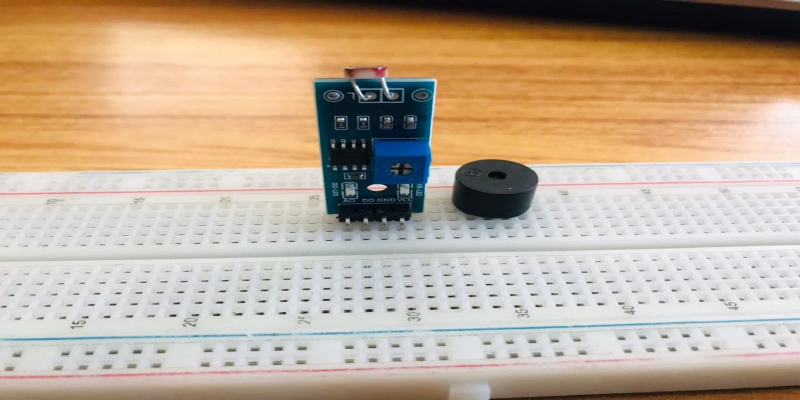.

## WIRING THE CIRCUIT

**Step 1:** Take the red jumper wire. Connect one end of the wire to the “VCC” port on the light dependent resistor and the other end to the “5V” port on the Arduino UNO.

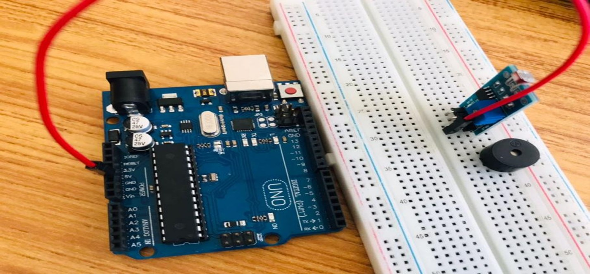.

**Step 2:** Take the black jumper wire. Connect one end of the wire to the “GND” hole on the Arduino UNO and the other end to the “GND” port on the light dependent resistor.

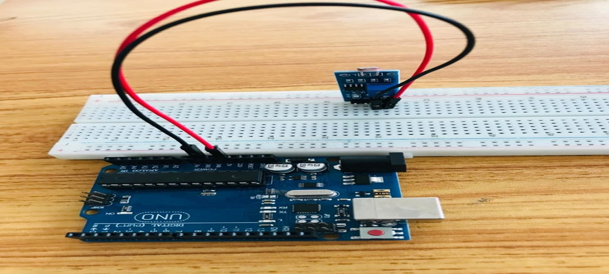.

**Step 3:** Take the white jumper wire. Connect one end of the wire to the “DO” hole on the resistor and the other end to hole number 2 on the Arduino UNO.

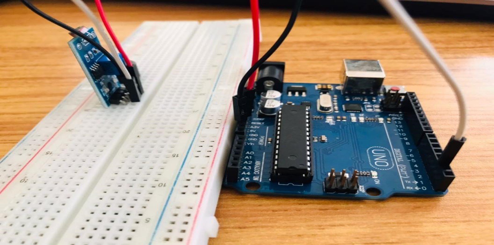.

**Step 4:** Take the green jumper wire. Connect one end of the wire to the “AO” port on the Arduino UNO to the “AO” port on the light dependent resistor.

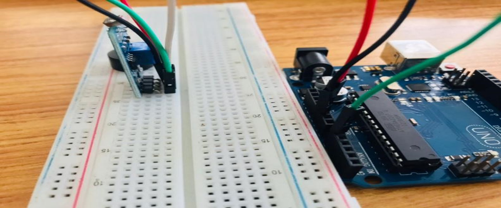.

**Step 5:** Take the brown jumper wire.  Connect one end of the wire to one of the ports of the longer pin of the LED and connect the other end to hole number 6 on the Arduino UNO.

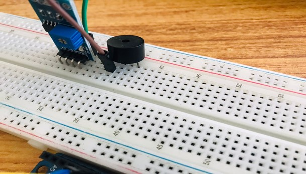.

**Step 6:** Take the purple jumper wire. Connect one end of the wire to one of the ports of the shorter pin of the LED and connect the other end to the “GND” on the Arduino UNO.

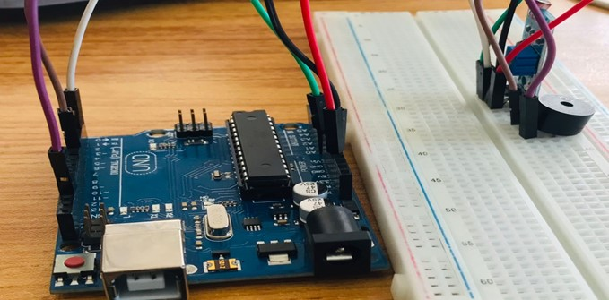.

## PROGRAMMING

**Step 1:** Open your Arduino IDE. See how to set up here: [Getting Started](../../../../README.md#getting-started).

**Step 2:** Type ```const int LDR_PIN = A0.```   as shown below in the image 
_**NB:** Make sure you avoid errors when typing. Do not omit any character or symbol especially the bracket { }  and semicolons ;  and place them as you see in the image . The code that comes after the two ash backslashes “//” are called comments. They are not part of the code that will be run, they only explain the lines of code. You can avoid typing them._

.

**Step 3:** Type ```const int DO_PIN = 2;``` as shown below in the image

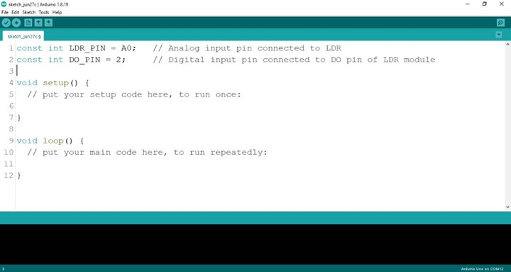.

**Step 4:** Type ```const int LED = 6;``` as shown below in the image

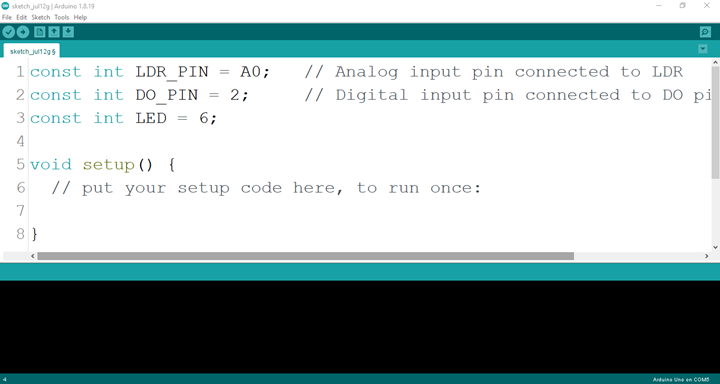.

**Step 5:** Type ```pinMode (DO_PIN, INPUT);``` as shown below in the image

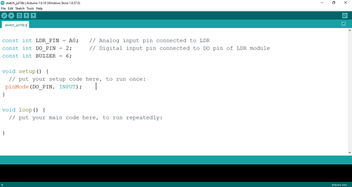.

**Step 6:** Type ```Serial.begin(9600);``` as shown below in the image

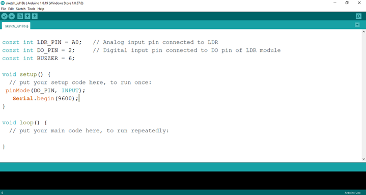.

**Step 7:** Type ```int ldrValue = analogRead (LDR_PIN); ``` as shown below in the image

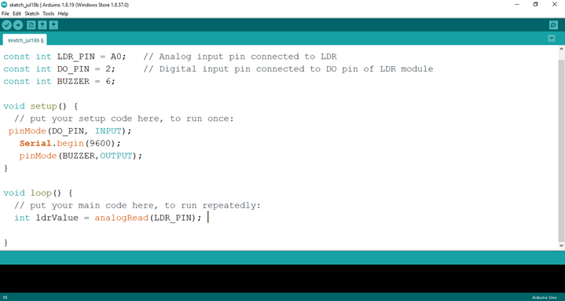.

**Step 8:** Type ```int digitalValue = digitalRead (DO_PIN);  ``` as shown below in the image

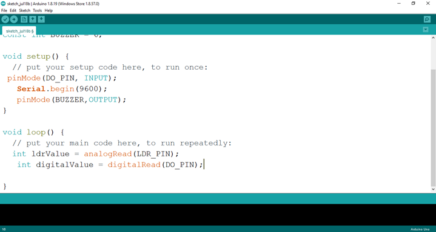.

**Step 9:** Type ```Serial.print(“Analog Value:”);``` as shown below in the image

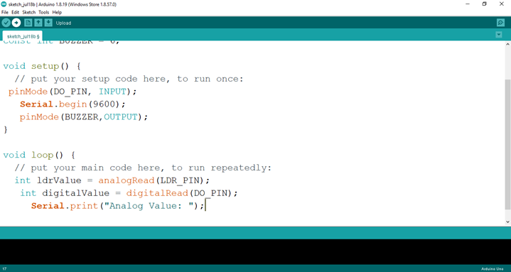.

**Step 10:** Type ```Serial.printIn(ldrValue);``` as shown below in the image

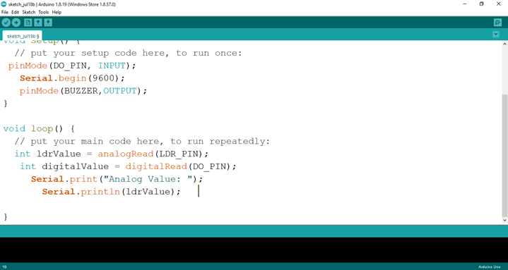.

**Step 11:** Type ```Serial.print(“Digital Value:”);``` as shown below in the image

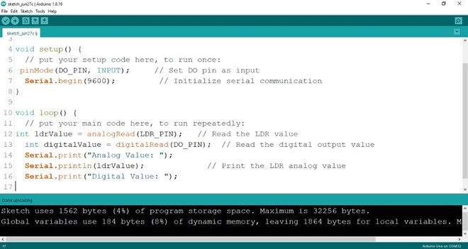.

**Step 12:** Type ```Serial.println(digitalValue);``` as shown below in the image

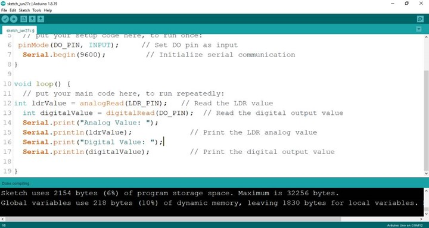.

**Step 13:** Type ```if(ldrValue < 100){``` as shown below in the image

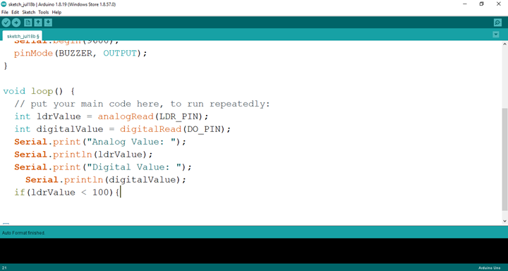.

**Step 14:** Type ```digitalWrite(BUZZER, HIGH);}``` as shown below in the image

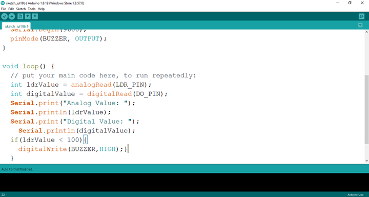.

**Step 15:** Type ```else{digitalWrite(BUZZER, LOW);}``` as shown below in the image

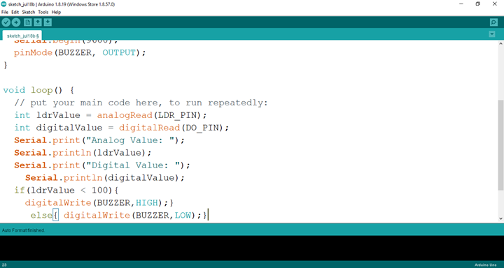.

**Step 16:** Save your code. _See the [Getting Started](../../../../README.md#getting-started) section_

**Step 17:** Select the arduino board and port _See the [Getting Started](../../../../README.md#getting-started) section:Selecting Arduino Board Type and Uploading your code_.

**Step 18:** Upload your code. _See the [Getting Started](../../../../README.md#getting-started) section:Selecting Arduino Board Type and Uploading your code_

## Conclusion

If you encounter any problems when trying to upload your code to the board, run through your code again to check for any errors or missing lines of code. If you did not encounter any problems and the program ran as expected, Congratulations on a job well done. You have now learnt how to program a buzzer to go off  in the absence of light. Practice, as they say makes perfect. Continue to work hard and in time you’ll master it.
