# Project 1: TRAFFIC LIGHT with STEMAIDE

| **Description** | You will learn how to detect the presence or absence of light.  |
|------------------|----------------------------------------------------------------|
| **Use case**     | Controlling visibility of light in streetlights at different times of the day. |

## Components (Things You will need)

|  |  |  ||||
|-------------------------|-------------------------|-------------------------|-------------------------|-------------------------|--------------------------|

## Building the circuit

Things Needed:

- Arduino Uno = 1  
- Arduino USB cable = 1
- Light dependent resistor   = 1
- Traffic module= 1
- Red jumper wire = 1
- Black jumper wire = 1
- Green jumper wire = 2
- Brown jumper wire = 1
- Purple jumper wire = 1
- Yellow jumper wire = 1
- Orange jumper wire = 1

## Mounting the component on the breadboard

**Step 1:** Take the light-dependent resistor and the breadboard and insert the light-dependent resistor into the horizontal connectors on the breadboard.


**Step 2:** Take the traffic light and insert it into the horizontal connectors on the breadboard.

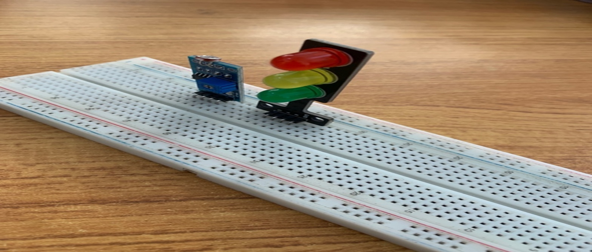


## WIRING THE COMPONENTS

**Step 1:** Take the green jumper wire. Connect one end of the wire to the “VCC” port on the resistor and the other end to the “5V” port on the Arduino UNO.

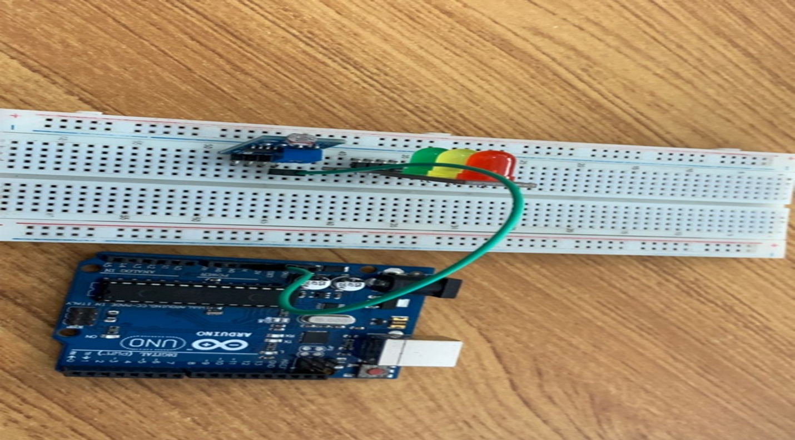


**Step 2:** Take the purple jumper wire. Connect one end of the wire to the “GND” hole on the Arduino UNO and the other end to the “GND” port on the resistor.

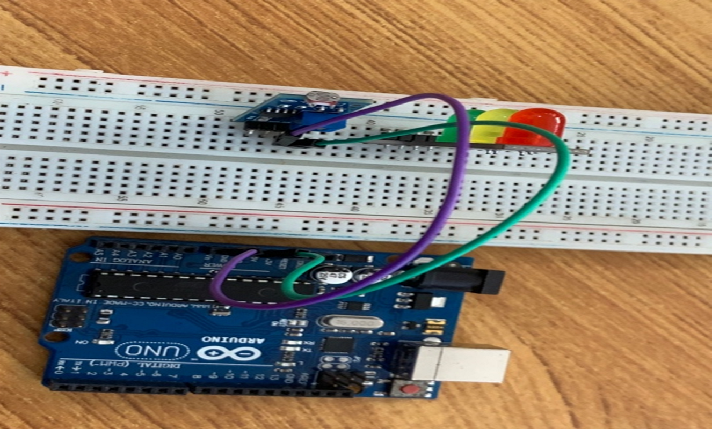

**Step 3:** Take the black jumper wire. Connect one end of the wire to the “DO” hole on the resistor and the other end to hole number 8 on the Arduino UNO.

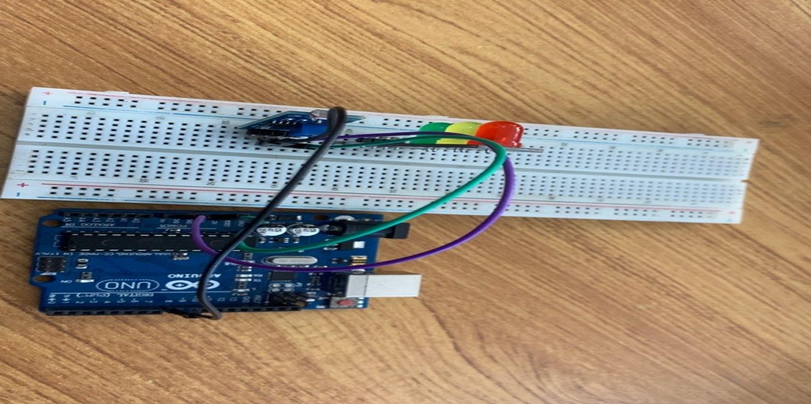

**Step 4:** Take the brown jumper wire. Connect one end of the wire to the “AO” port on the Arduino UNO to the “AO” port on the resistor.

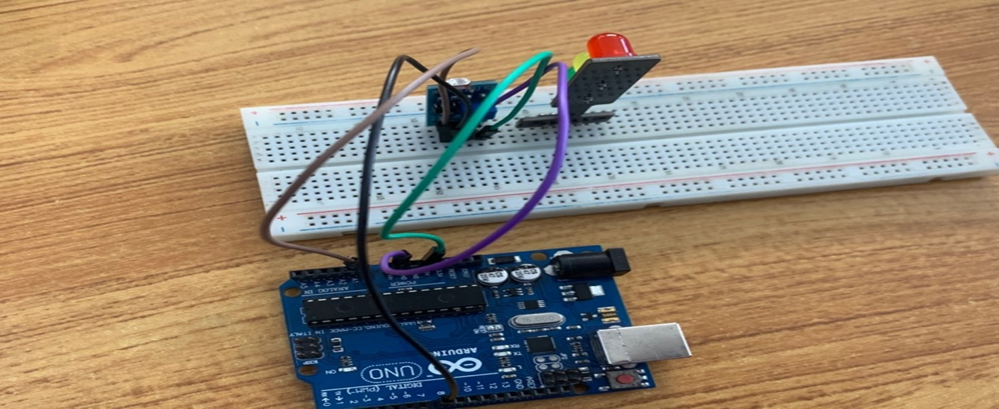

**Step 5:**Take the orange jumper wire.  Connect one end of the wire to the port labelled “R” on the traffic light and connect the other end to digital pin 5 on the Arduino UNO.

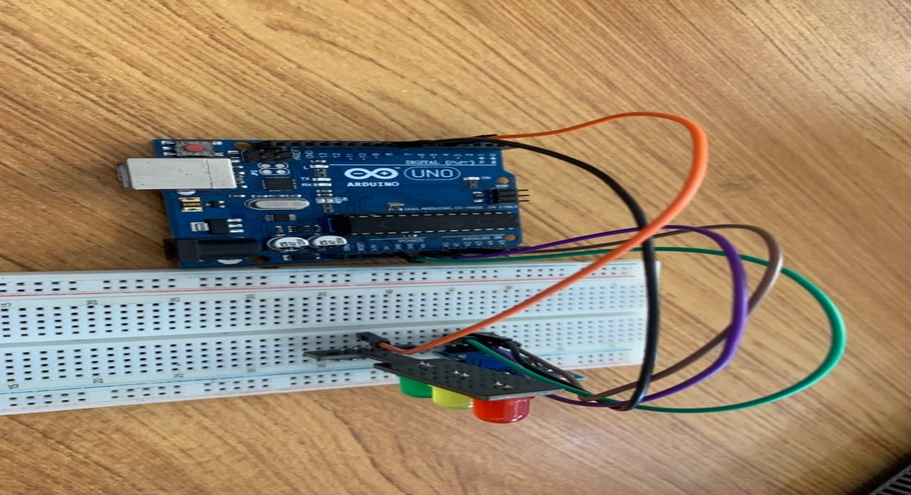

**Step 6:** Take the green jumper wire. Connect one end of the wire to the port labelled “Y” on the traffic light and connect the other end to digital pin 6 on the Arduino UNO.


**Step 7:** Take the yellow jumper wire. Connect one end of the wire to the port labelled “G” on the traffic light and connect the other end to digital pin 7 on the Arduino UNO.

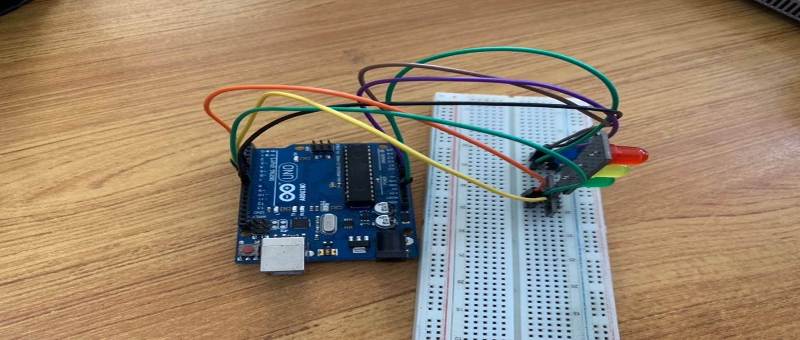

**Step 8:** Take the red jumper wire. Connect one end of the wire to the port labelled “GND” on the traffic light and connect the other end to the “GND” on the Arduino UNO.


**Step 9:** Take the yellow jumper wire. Connect one end of the wire to the port labelled “G” on the traffic light and connect the other end to digital pin 7 on the Arduino UNO.

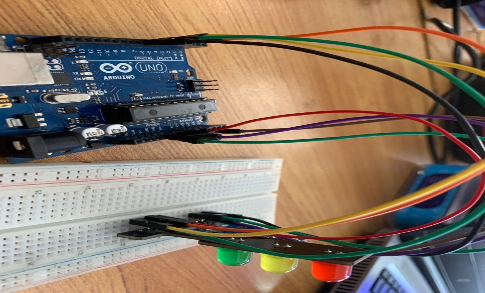


## PROGRAMMING

**Step 1:** Open your Arduino IDE. See how to set up here: [Getting Started](../../../../README.md#getting-started).

**Step 2:** Type ``` const int LDR_PIN = A0;``` as shown below in the image

_**NB:** Make sure you avoid errors when typing. Do not omit any character or symbol especially the bracket { }  and semicolons ;  and place them as you see in the image . The code that comes after the two ash backslashes “//” are called comments. They are not part of the code that will be run, they only explain the lines of code. You can avoid typing them._

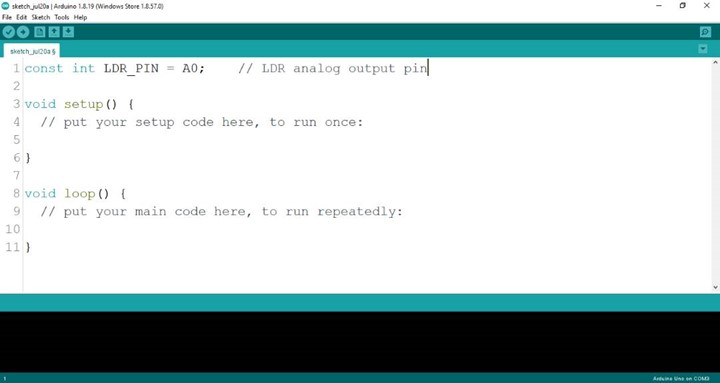

**Step 3:** Type ``` const int DO_PIN = 8; ``` as shown below in the image.


**Step 4:** Type ``` const int RED_PIN = 5; ``` as shown below in the image.


**Step 5:** Type ``` const int GREEN_PIN = 6; ``` as shown below in the image.

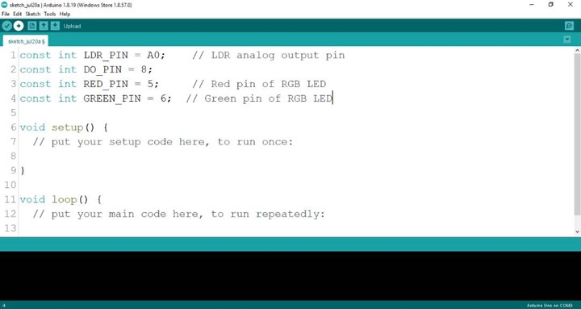


**Step 6:** Type ``` const int YELLOW_PIN = 7; ``` as shown below in the image.

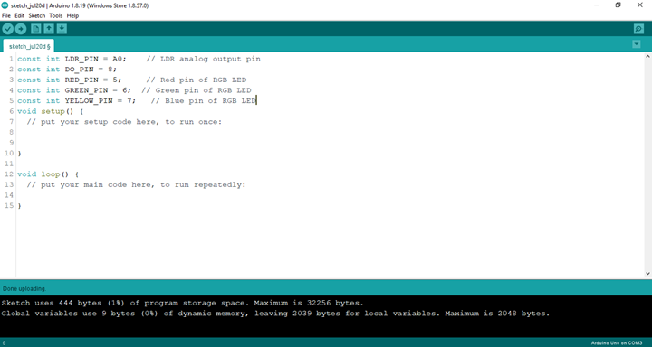


**Step 7:** Type ``` int 1drValue; ``` as shown below in the image.

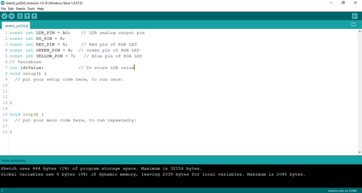


**Step 8:** Type ``` int digitalValue; ``` as shown below in the image.


**Step 9:** Type ``` int redValue, greenValue, blueValue; ``` as shown below in the image.

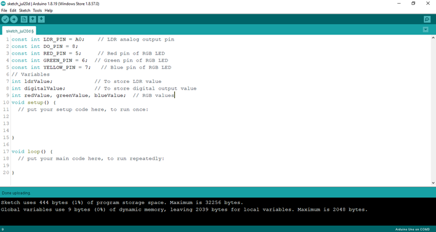

**Step 10:** Type ``` pinMode (DO_PIN, INPUT); ``` as shown below in the image.

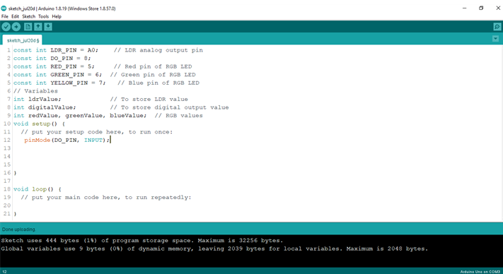

**Step 11:** Type ``` Serial.begin(9600); ``` as shown below in the image.

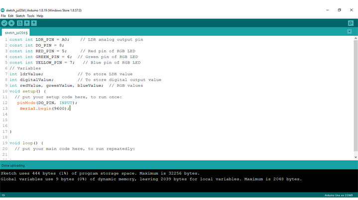

**Step 12:** Type ``` pinMode (RED_PIN, OUTPUT); ``` as shown below in the image.

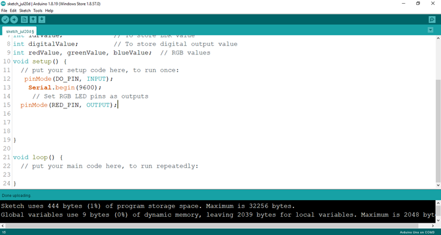

**Step 13:** Type ``` pinMode (GREEN_PIN, OUTPUT); ``` as shown below in the image.

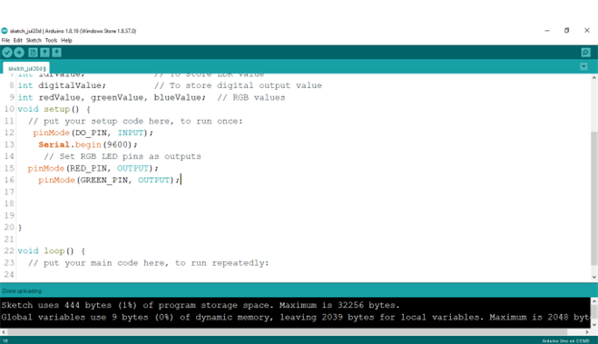

**Step 14:** Type ``` pinMode (YELLOW_PIN, OUTPUT); ``` as shown below in the image.

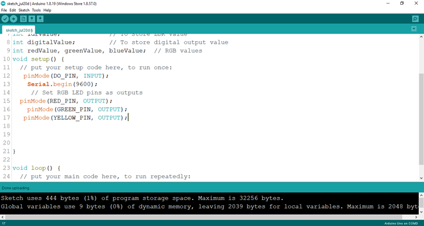

**Step 15:** Type ```Serial.print (“Analog Value:”);
	          Serial.printIn (ldrValue);
		       Serial.printIn (“Digital Value:”);
		       Serial.printIn (digitalValue);
             ; ``` as shown below in the image.

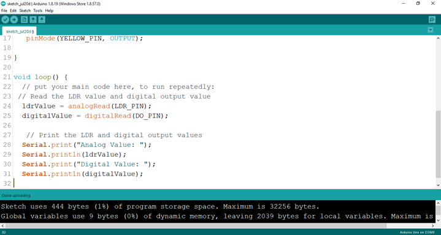

**Step 16:** Type ```if (ldrValue < 100) {
		  digitalWrite (RED_PIN, HIGH);
		  delay (1000);
	     digitalWrite (RED_PIN, LOW);
		  delay (1000);
		  digitalWrite (GREEN_PIN, HIGH);
		  delay (1000);
		  digitalWrite (GREEN_PIN, LOW);
		  delay (1000);
		  digitalWrite (YELLOW_PIN, HIGH);
		  delay (1000);
		  digitalWrite (YELLOW_PIN, LOW);
		  delay (1000);
             ``` as shown below in the image.

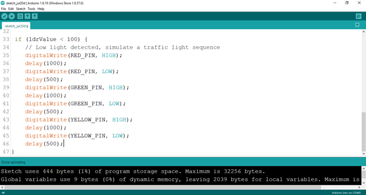

**Step 17:** Type ```else {
        digitalWrite (RED_PIN, LOW);
        digitalWrite (GREEN_PIN, LOW); 
        digitalWrite (YELLOW_PIN, LOW) ; ``` as shown below in the image.

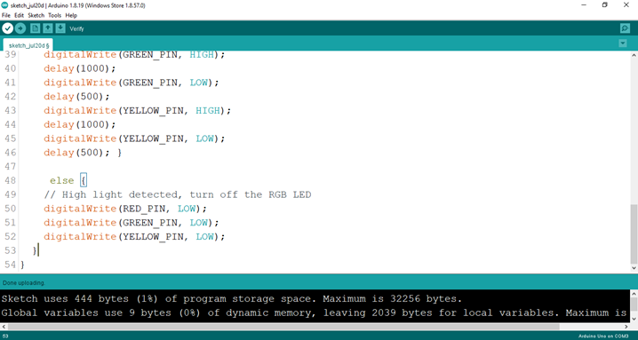

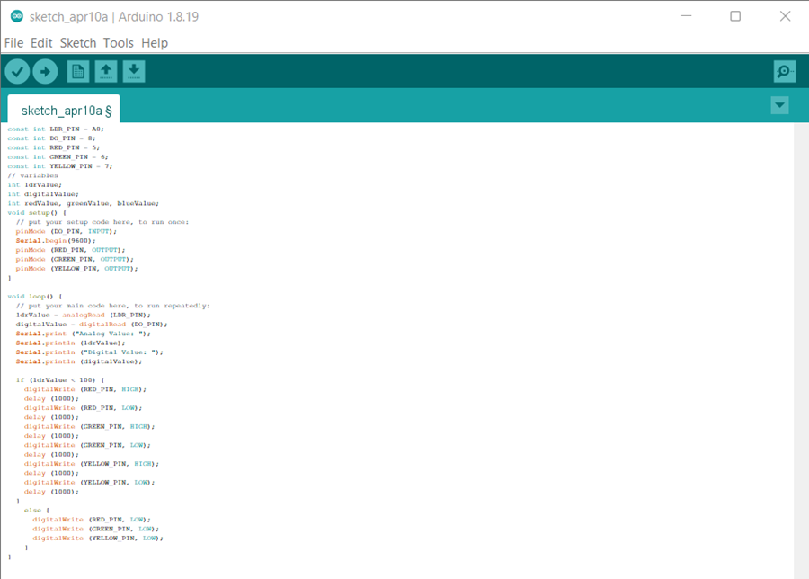


## CONCLUSION
If you encounter any problems when trying to upload your code to the board, run through your code again to check for any errors or missing lines of code. If you did not encounter any problems and the program ran as expected Congratulations on a job well done. You have now learnt how to code the traffic light to change colors in the presence of light. Practice, as they say makes perfect. Continue to work hard and in time you’ll master it.

