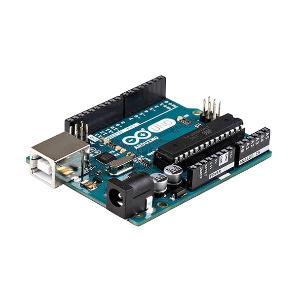

# Project 2: OPERATING A SOUND SENSOR WIITH ONE LED

| **Description** | You will learn how to build a simple circuit with sound sensor and led |
|------------------|----------------------------------------------------------------|
| **Use case**     | Imagine you want to check the amount of noise in your area and your led(light) alerting you on how noisy a particular area is. |

## Components (Things You will need)

|  |  |  |  || |
|-------------------------|-------------------------|-------------------------|-------------------------|-------------------------|-------------------------|

## Building the circuit

Things Needed:

-	Arduino Uno = 1
-	Arduino USB cable = 1
-	Sound sensor = 1
-	Red jumper wire = 1
-	Black jumper wire = 1
-	Green jumper wire = 1
-	Orange jumper wire= 1
-	Blue jumper wire = 1
-	Purple jumper wire= 1
-	Breadboard = 1


## Mounting the component on the breadboard

**Step 1:** Insert on the sound sensor on the bread board and make sure each pair of the pins are connected on each side of the bridge: 

.
 
**Step 2:** Insert on the LED on the bread board and make sure each pair of the pins are connected on each side of the bridge: 

.

_**NB:** Make sure you identify where the positive pin (+) and the negative pin (-) is connected to on the breadboard. The longer pin of the LED is the positive pin and the shorter one, the negative PIN_.

## WIRING THE CIRCUIT

### Things Needed:

-	Arduino Uno = 1
-	Red male-to-male jumper wire = 1
-	Black male-to-male jumper wire = 1
-	Green male-to-male jumper wire = 1
-	Orange male-to-male jumper wire=1
-	Blue jumper wire = 1
-	Yellow jumper wire = 1


**Step 1:** Connect the red male-to-male jumper wire to (+) on the sound sensor to 5V on the Arduino UNO board as shown in the image.


**Step 2:** Connect the black male-to-male jumper wire to (G) on the sound sensor and the other end of the wire to GND on the Arduino UNO.  As shown in the picture below:

.

**Step 3:** Connect the black male-to-male jumper wire to (A0) on the sound sensor and the other end of the wire to A2 on the Arduino UNO.  As shown in the picture below

.

**Step 4:** Connect the orange male-to-male jumper wire to (D0) on the sound sensor and the other end of the wire to digital pin 6 on the Arduino board as shown below.

.

**Step 5:** connect blue male-to-male jumper wire to the positive (longer leg) of the LED and the other end to the digital pin 8 on the Arduino board as shown below.

.

**Step 6:** Using the purple male-to-male jumper wire, connect one end of the wire to negative (shorter leg) of the LED and the other end to the “GND” on the Arduino as shown below.

.

_make sure you connect the arduino usb blue cable to the Arduino board_.

.

_just as shown above, connect your USB cable to the Arduino board and to your laptop._

## PROGRAMMING

**Step 1:** Open your Arduino IDE. See how to set up here: [Getting Started](../../../../README.md#getting-started).

**Step 2:** Type
```
const int SoundSensorPin = A0; 
const int SoundSensorD0 = 6;
const int LED = 8; 
 ``` 
 as shown in the picture below.


.

**Step 3:** In the {} after the void setup (), Type
```
 pinMode (ledPin, OUTPUT); 
pinMode (soundSensorDOPin, INPUT);  
pinMode(SoundSensorPin, INPUT);
Serial.begin (9600); 
```
as shown below; 

.

**Step 3:** In the {} after the void loop (), Type
```
int SensorData= digitalRead(SoundSensorDO); 
int SoundValue = analogRead (SoundSensorPin); 

```
as shown below; 

.
-	The above code reads data from the soundSensorPin.

**Step 3:** Type ```if (soundValue > 100 ) {  }``` as shown below; 

.

**Step 3:** Type ```else { } ; ``` as shown in the image below; 

.

**Step 2:** Type
```
digitalWrite(LED, HIGH); 
Serial.println(SoundValue);
delay(200);
Serial.printIn (SoundValue); 
 ``` 
 as shown in the picture below.


.

**Step 3:** Type ``` digitalWrite (LED, LOW); ``` as shown in the image below; 

.

**Step 4:** Save your code. _See the [Getting Started](../../../../README.md#getting-started) section_

**Step 5:** Select the arduino board and port _See the [Getting Started](../../../../README.md#getting-started) section:Selecting Arduino Board Type and Uploading your code_.

**Step 6:** Upload your code. _See the [Getting Started](../../../../README.md#getting-started) section:Selecting Arduino Board Type and Uploading your code_


## CONCLUSION
If you encounter any problems when trying to upload your code to the board, run through your code again to check for any errors or missing lines of code. If you did not encounter any problems and the program ran as expected, Congratulations on a job well done. 


 
