# Project 053: OPERATING A SOUND SENSOR WITH TWO LEDs

| **Description** | You will learn how to turn ON and OFF of the LEDs using the SOUND SENSOR.  |
|------------------|----------------------------------------------------------------|
| **Use case**     | Imagine you want to check the amount of noise in your area using LEDs. |

## Components (Things You will need)

|  |  |  ||||
|-------------------------|-------------------------|-------------------------|-------------------------|------------------------|--------------------------|

## Building The Circuit(Things You Will Need)

- Arduino Uno = 1  
- Arduino USB cable = 1
- Sound Sensor  = 1
- LED = 2
- Red jumper wire = 1
- Black jumper wire = 2
- Green jumper wire = 1
- Orange jumper wire = 1
- Blue jumper wire = 1
- Purple Jumper Wire = 1
- White Jumper = 1
- Brown Jumper = 1
- Breadboard = 1


## Mounting The Component On The Breadboard

**Step 1:** Insert the sound sensor on the bread board and make sure each pair of the pins are connected on each side of the bridge. As shown in the picture below: 


**Step 2:** Connect the LEDs to the breadboard as shown below.

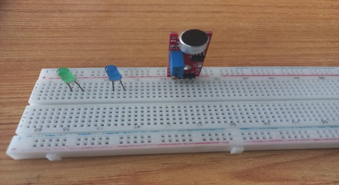


## WIRING THE COMPONENTS

**Step 1:** Connect the red male-to-male jumper wire to (+) on the sound sensor to 5V on the Arduino UNO board as shown in the image.

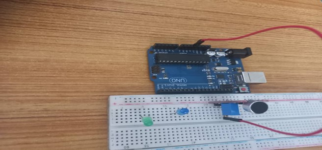

**Step 2:** Connect the black male-to-male jumper wire to (G) on the sound sensor and the other wire to GND on the Arduino UNO.  As shown in the picture below:

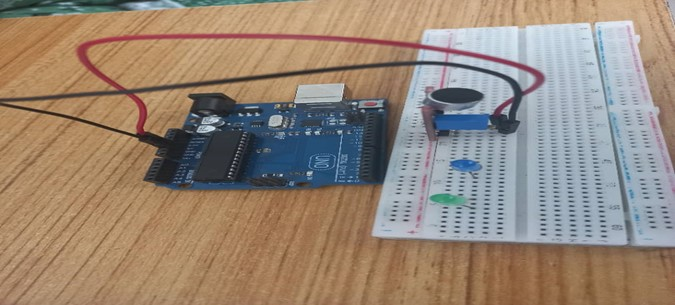

**Step 3:** Connect the black male-to-male jumper wire to (A0) on the sound sensor and the other end of the wire to GND on the Arduino UNO.  As shown in the picture below.

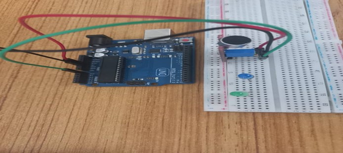

**Step 4:** Connect the orange male-to-male jumper wire to (D0) on the sound sensor and the other end of the wire to digital pin 6 on the Arduino board as shown below.

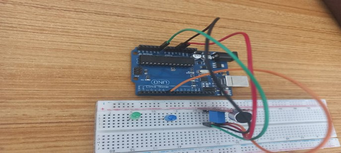

**Step 5:** Connect the blue male-to-male jumper wire to the positive (longer leg) of the LED and the other end to digital pin 8 on the Arduino board, as shown below.

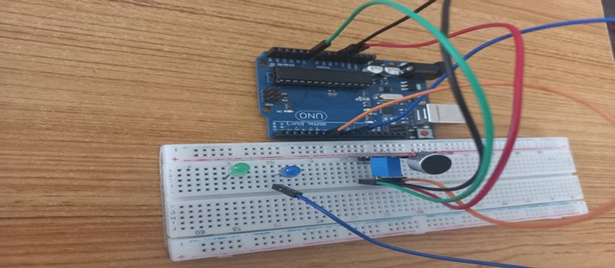

**Step 6:** Using the purple male-to-male jumper wire, connect one end to the negative (shorter leg) of the LED and the other end to the “GND” on the Arduino, as shown below.

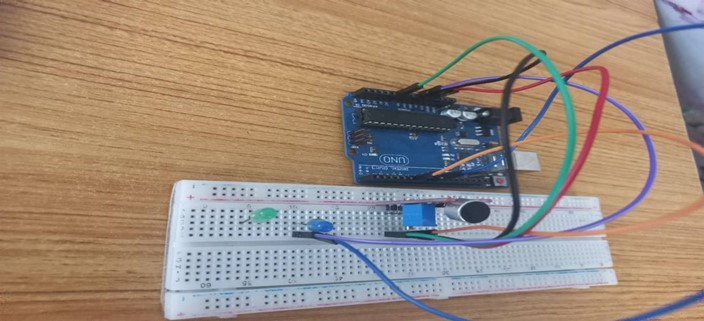

**Step 7:** Connect the blue male-to-male jumper wire to the positive (longer leg) of the LED and the other end to digital pin 9 on the Arduino board, as shown below.

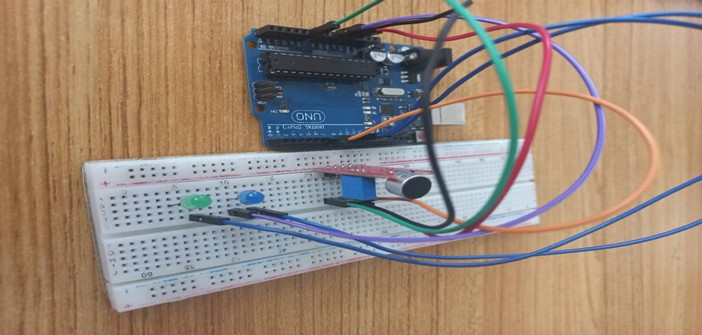

**Step 8:** Using the black male-to-male jumper wire, connect one end of the wire to the negative (shorter leg) of the LED and the other end to the “GND” on the Arduino as shown below.

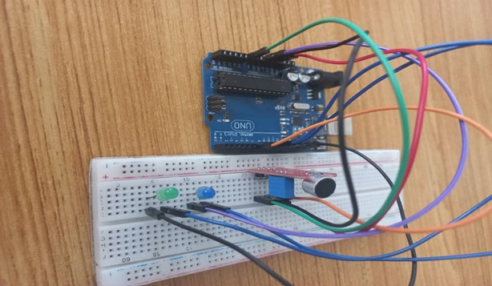

## PROGRAMMING

**Step 1:** Open your Arduino IDE. See how to set up here: [Getting Started](../../../../README.md#getting-started).

**Step 2:** Type ``` const int SoundSensorAPin = A0; 
                const int SoundSensorDO = 6;
                const int LED = 8;
                const int LED2 = 9; 
                 ``` as shown in the picture below.

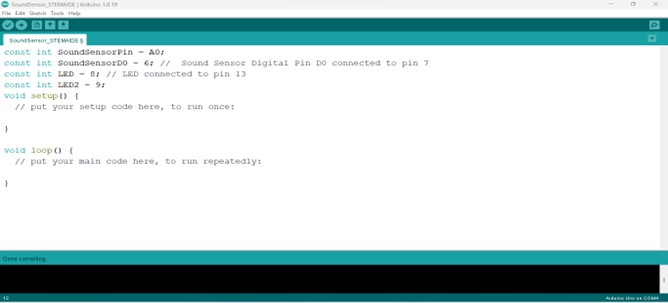

_**NB:** Make sure you avoid errors when typing. Do not omit any character or symbol especially the bracket {} and semicolons; and place them as you see in the image. The code that comes after the two  backslashes “//” are called comments. They are not part of the code that will be run, they only explain the lines of code. You can avoid typing them._

**Step 3:** In the { } after the void setup (),Type ```       pinMode(SoundSensorPin, INPUT);
        pinMode (soundSensorDO, INPUT);  
        pinMode (LED, OUTPUT); 
        pinMode (LED2, OUTPUT);
        Serial.begin (9600);  ``` as shown below in the image.

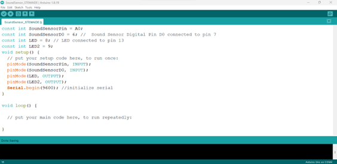

_The code above activates the serial monitor and LEDS._

**Step 4:** In the {} after the void loop (), Type ``` 
int SensorData = digitalRead(SoundSensorDO); 
int SoundValue = analogRead (SoundSensorPin); ``` as shown below in the image.

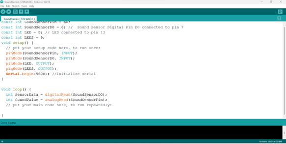

_The above code reads data from the soundSensorPin._

**Step 5:** Type ``` if (soundValue > 100 ) {  } ; ``` as shown below in the image.

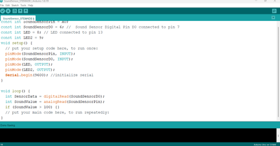

**Step 6:** And on the next line, Type ```else { } ;```

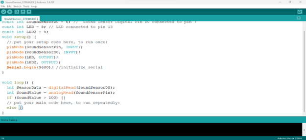

**Step 7:** Type ```   digitalWrite(LED, HIGH); 
                   digitalWrite(LED2, HIGH);
                   Serial.println(SoundValue);
                    delay(200);
                    Serial.printIn(SoundValue) ``` as shown below in the image.

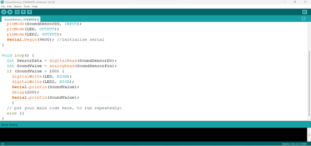

**Step 8:** Type 
    ``` digitalWrite (LED, LOW);
        digitalWrite (LED, LOW);
    ``` as shown below in the image.

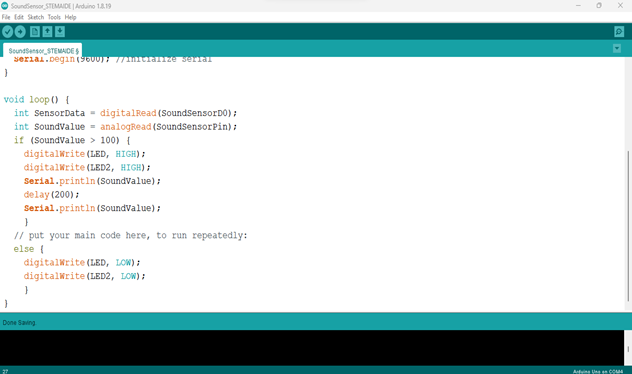

## CONCLUSION
If you encounter any problem when trying to upload your code to the board, run through your code 
again to check for any errors or missing lines of code. If you do not encounter any problem and the program runs as expected, Congratulations on a job well done. 

