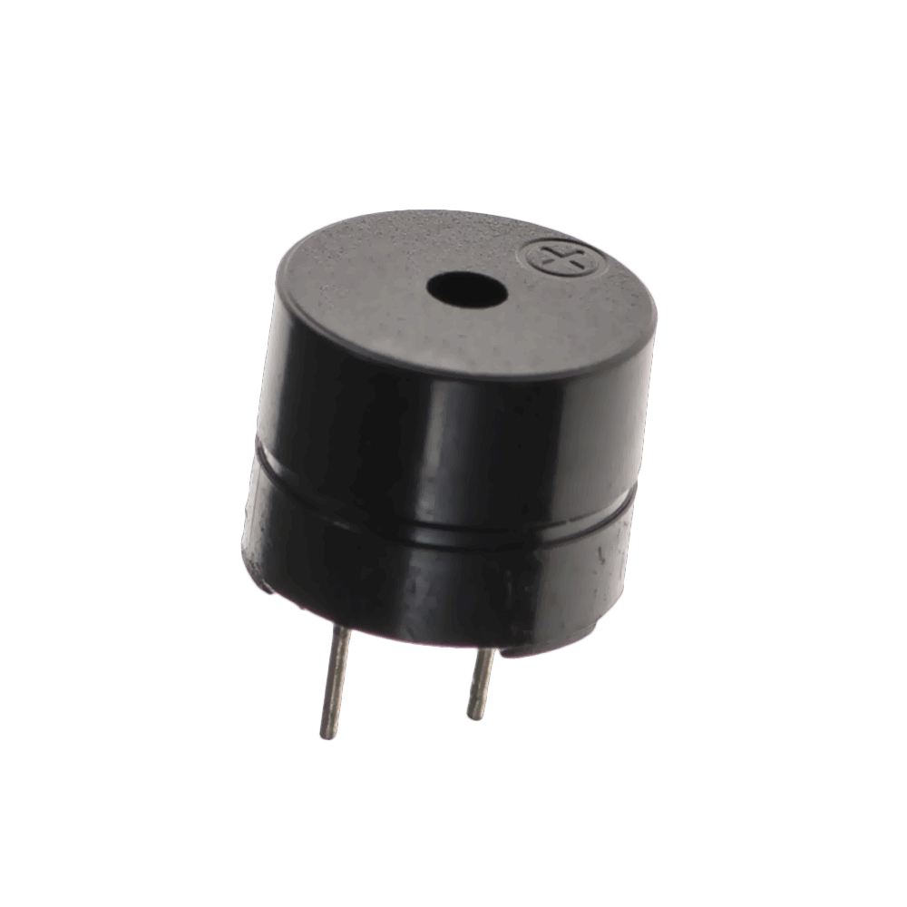

# Project 1: LED ON

| **Description** | This smart security system uses an ultrasonic sensor to detect objects within a specified range. When an object is detected, a red LED lights up, and a buzzer sounds to alert users. |
|------------------|----------------------------------------------------------------|
| **Use case**     | Ideal for securing entry points, monitoring restricted areas, or alerting when someone enters a protected zone.. |

## Components (Things You will need)

|  |  |  |  ||  |  |
|-------------------------|-------------------------|-------------------------|-------------------------|-------------------------|-------------------------|-------------------------|

## Building the circuit

Things Needed:

-	Arduino Uno = 1
-	Arduino USB cable = 1
-	Red LED = 1
-	Ultrasonic sensor = 1
-	Buzzer = 1
-	Red jumper wire = 1
-	Blue jumper wire = 1
-	Black jumper wires = 2
-	White jumper wire = 1
-	Orange jumper wire = 1
-	Green jumper wire = 1
-	Brown jumper wire =1


## Mounting the component on the breadboard

**Step 1:** Take the breadboard, the Ultrasonic sensor and insert it into the vertical connectors on the breadboard as shown below.

.

**Step 2:** Take the Buzzer and insert it into the vertical connectors on the breadboard beside the Ultrasonic sensor as shown below.

.

**Step 3:** Take the red LED and insert it into the vertical connectors on the breadboard beside the buzzer as shown below.

.

_**NB:** Make sure you identify where the positive pin (+) and the negative pin (-) is connected to on the breadboard. The longer pin of the LED is the positive pin and the shorter one, the negative PIN_.

## WIRING THE CIRCUIT

### Things Needed:

-	Red jumper wire = 1
-	Blue jumper wire = 1
-	Black jumper wires = 2
-	White jumper wire = 1
-	Orange jumper wire = 1
-	Green jumper wire = 1
-	Brown jumper wire =1


**Step 1:** Connect one end of red male-to-male jumper wire to the VCC pin of the ultrasonic sensor on the breadboard and the other end to 5v on the Arduino UNO as shown below.


**Step 2:** Connect one end of white male-to-male jumper wire to the TRIG pin of the ultrasonic sensor on the breadboard and the other end to digital pin number 6 on the Arduino UNO as shown below.

.

**Step 3:** Connect one end of black male-to-male jumper wire to the ECHO pin of the ultrasonic sensor on the breadboard and the other end to digital pin number 7 on the Arduino UNO as shown below.


**Step 4:**Connect one end of brown male-to-male jumper wire to the GND pin of the ultrasonic sensor on the breadboard and the other end to GND on the Arduino UNO as shown below.

.

**Step 5:** Connect one end of the black male-to-male jumper wire to the positive pin of the buzzer on the breadboard to digital pin number 8 on the Arduino UNO as shown below

.

**Step 6:** Connect one end of the orange male-to-male jumper wire to the negative pin of the buzzer on the bread board to GND on the Arduino UNO.

.

**Step 7:** Connect one end of the green male-to-male jumper wire to the positive pin of Red LED on the breadboard to digital pin number 9 on the Arduino UNO as shown below.

.

**Step 8:** Connect one end of the blue male-to-male jumper wire to the negative pin of Red LED on the bread board to GND on the Arduino UNO.

.
_make sure you connect the arduino usb use blue cable to the Arduino board_.

## PROGRAMMING

**Step 1:** Open your Arduino IDE. See how to set up here: [Getting Started](../../../../README.md#getting-started).

```
// Pin definitions
const int trigPin = 6;
const int echoPin = 7;
const int redLEDPin = 9;
const int buzzerPin = 8;
const int distanceThreshold = 20; // Threshold in cm

void setup() {
 // put your setup code here, to run once:
  pinMode(trigPin, OUTPUT);
  pinMode(echoPin, INPUT);
  pinMode(redLEDPin, OUTPUT);
  pinMode(buzzerPin, OUTPUT);
  Serial.begin(9600);
}

void loop() { 
 // put your main code here, to run repeatedly:
  long duration;
  int distance;

  // Trigger ultrasonic sensor
  digitalWrite(trigPin, LOW);
  delayMicroseconds(2);
  digitalWrite(trigPin, HIGH);
  delayMicroseconds(10);
  digitalWrite(trigPin, LOW);

  // Read echo pin
  duration = pulseIn(echoPin, HIGH);
  distance = duration * 0.034 / 2;

  // Check distance and activate alarm
  if (distance < distanceThreshold) {
    digitalWrite(redLEDPin, HIGH);
    tone(buzzerPin, 1000);
  } else {
    digitalWrite(redLEDPin, LOW);
    noTone(buzzerPin);
  }

  delay(100);
  //Read the Serial monitor
  Serial.print(distance);
  Serial.println("cm");
  delay(500);
}
  ```

**Step 4:** Save your code. _See the [Getting Started](../../../../README.md#getting-started) section_

**Step 5:** Select the arduino board and port _See the [Getting Started](../../../../README.md#getting-started) section:Selecting Arduino Board Type and Uploading your code_.

**Step 6:** Upload your code.

## CONCLUSION
This project provides a simple and effective way to enhance security using readily available components. It’s easy to set up and suitable for beginners.


