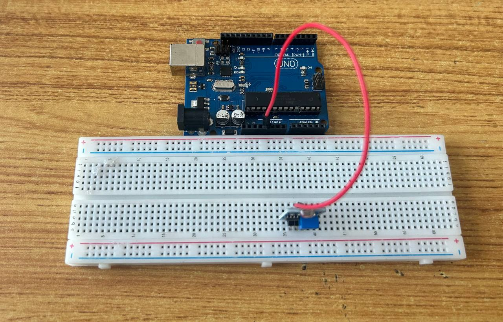
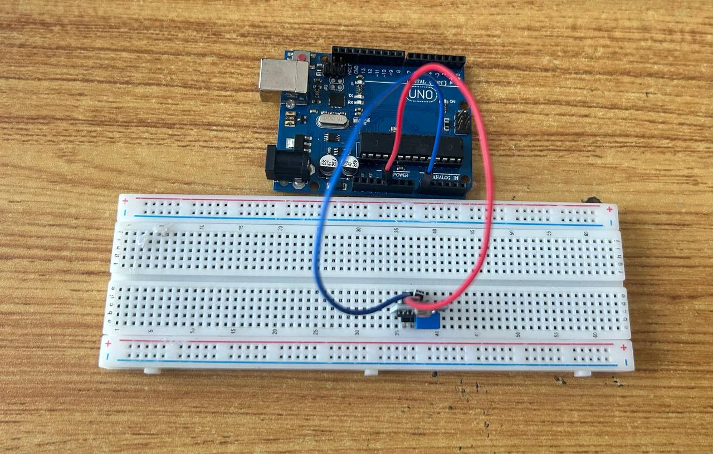
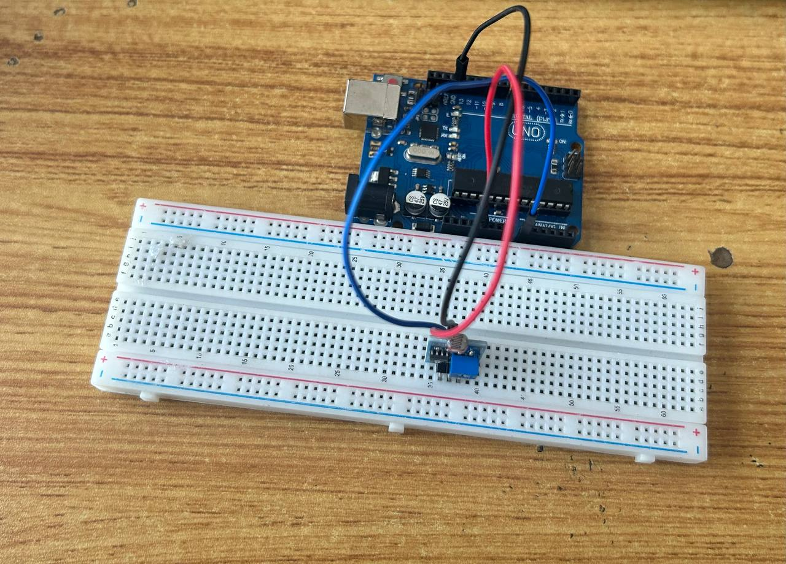
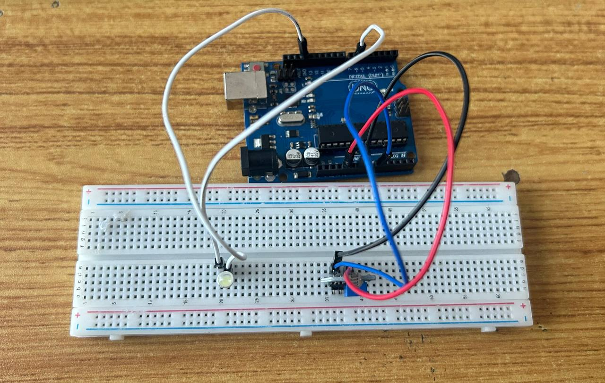

# Project 2: SMART BED LIGHT

| **Description** | Double LED ON is a simple project that guides you in turning on two LEDs at the same time.  |
|------------------|----------------------------------------------------------------|
| **Use case**     | This project finds utility in basic signaling setups. For instance, it could be applied in an easier and basic lighting system, where two LEDs turning on together provide ample brightness when someone enters a room. |

## Components (Things You will need)

|  |  |  |  || |
|-------------------------|-------------------------|-------------------------|-------------------------|-------------------------|-------------------------|

## Building the circuit

Things Needed:

-	Arduino Uno Board: 1
-	Arduino USB Cable: 1
-	Red jumper wire: 1
-	White LED: 1
-   LDR : 1
-   Resistor : 1
-	Blue jumper wire: 1

## Mounting the component on the breadboard

**Step 1:** Step 1: Take the breadboard, the white LED and insert it into the vertical connectors on the breadboard.

_**NB** Make sure you identify where the positive pin (+) and the negative pin (-) is connected to on the breadboard. The longer pin of the LED is the positive pin and the shorter one, the negative PIN_

## WIRING THE CIRCUIT

### Things Needed:

-	Red male-to-male jumper wires: 1
-	Black male-to-male jumper wire: 1
-	White male-to-male jumper wire: 1
-	Blue male-to-male jumper wire: 1

**Step 1:** : Connect one end of red male-to-male jumper wire to VCC of the LDR on the breadboard and the other end to 5V on the Arduino UNO.

**Step 2:** : Connect one end of the blue male-to-male jumper to A0 of the LDR on the breadboard and the other end to A0 on the Arduino UNO.

.

**Step 3:** : Connect one end of the black male-to-male jumper to GND of the LDR on the breadboard and the other end to GND on the Arduino UNO.

.

**Step 4:** Connect one end of the white male-to-male jumper wire to the positive pin of LED on the bread board to digital pin number 6 on the Arduino UNO through the resistor as shown below.

.

**Step 5:** Connect one end of the white male-to-male jumper wire to the negative pin of the LED on the breadboard and the other end to GND on the Arduino UNO.

.

_Make sure you connect the Arduino Board to the Laptop USB port using the USB cable in the Kit_

## PROGRAMMING

**Step 1:** Open your Arduino IDE. See how to set up here: [Getting Started](../../../../README.md#getting-started).

## CONCLUSION
In summary, the two-LED project presents a basic yet significant step in understanding parallel LED control. By simultaneously lighting up two LEDs, learners gain insight into simple circuit connections and programming synchronization. This project serves as a starting point for more complex configurations while highlighting the fundamental principle of coordinated electronic actions, setting the stage for broader exploration in electronics and automation.