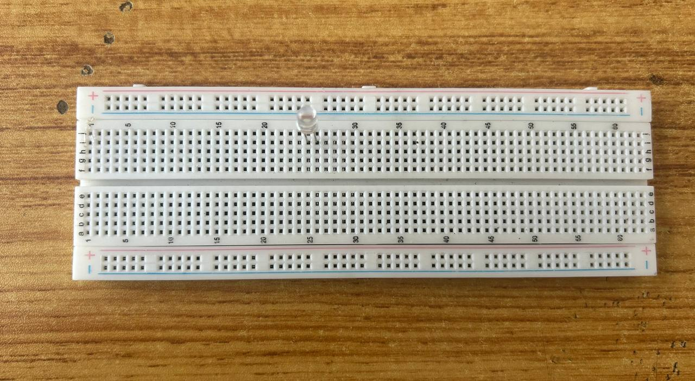
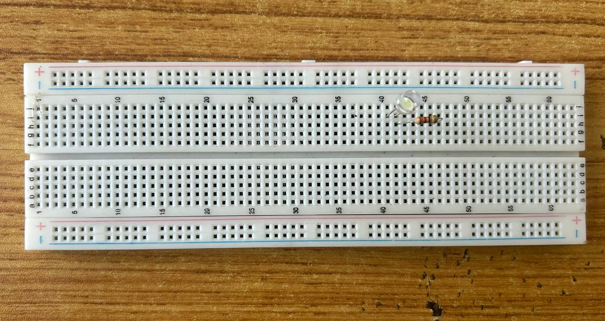
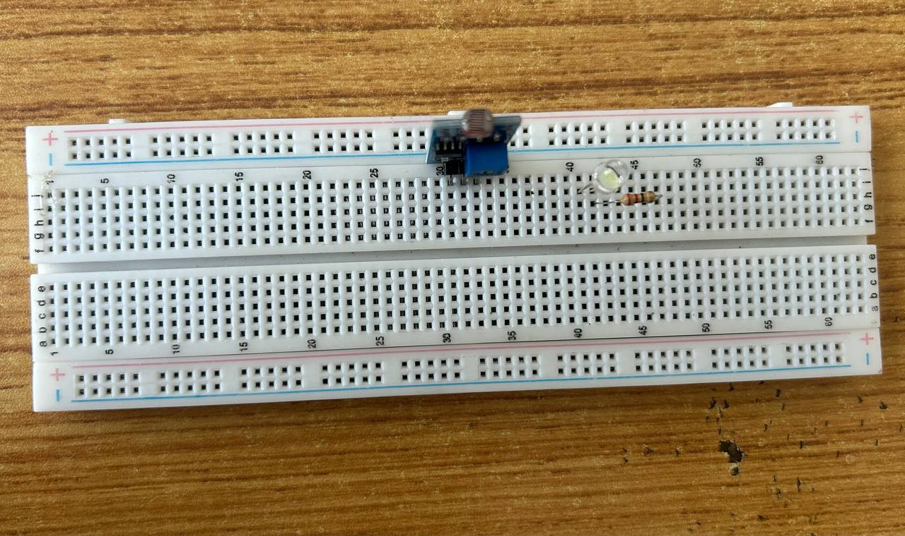
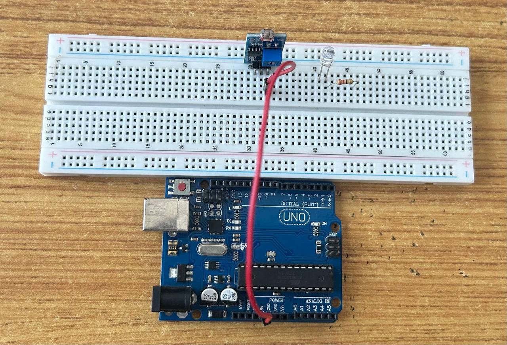
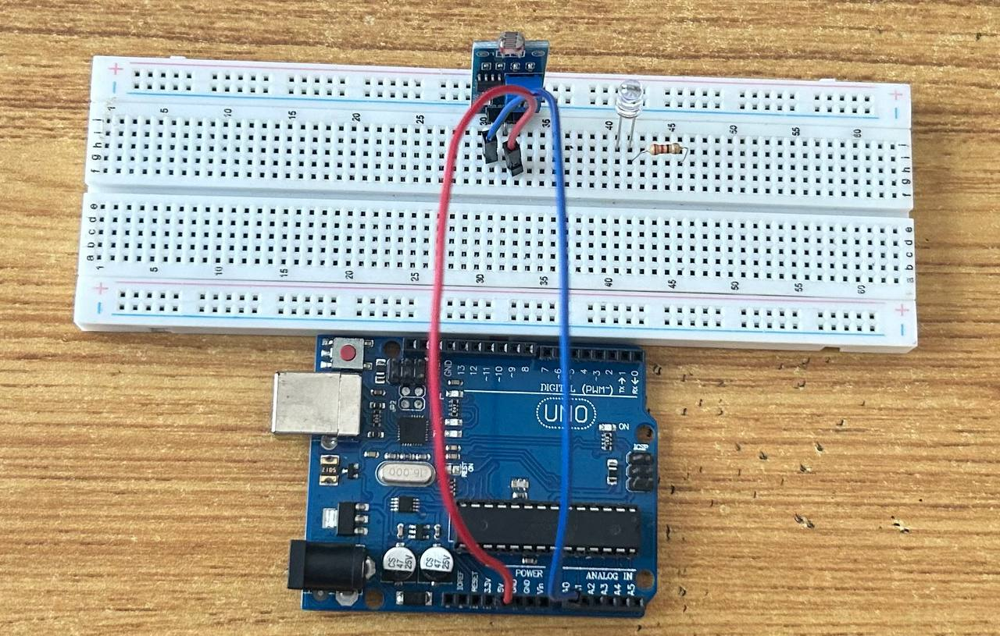
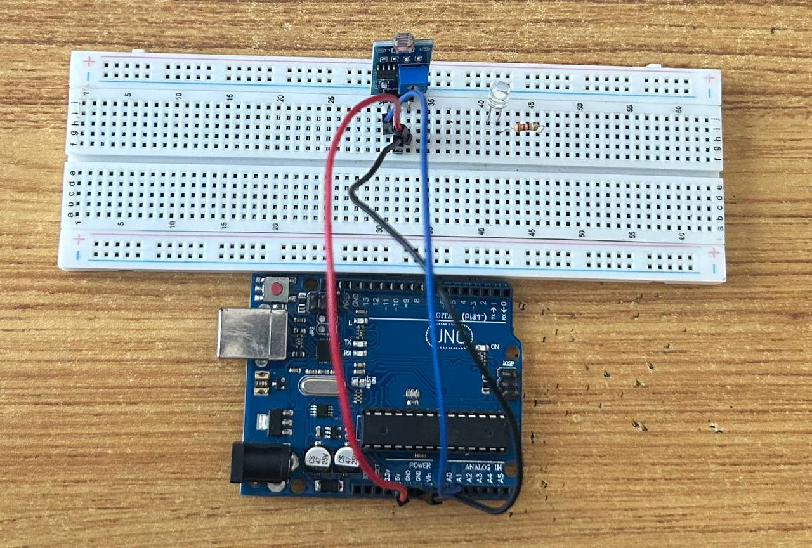
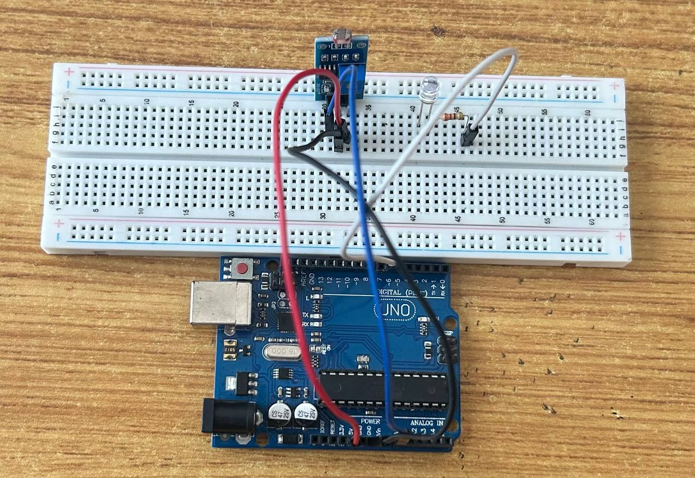
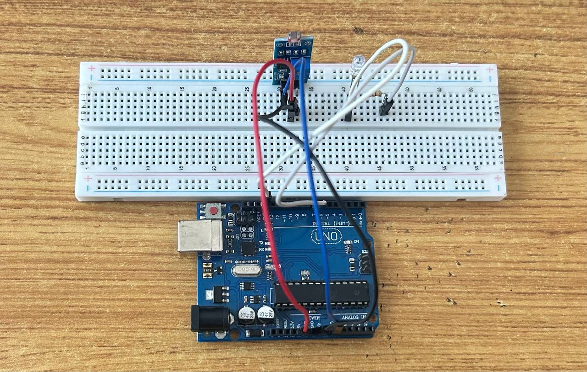

# Project 2: SMART STREET LIGHT SYSTEM

| **Description** | The Smart Street Light System is a simple project designed to automatically control lighting based on environmental conditions, such as light intensity.
|------------------|-------------------------------------------------------------------------------------------------------------------------------------------------------------------------------------|
| **Use case**     | This project finds utility in providing basic automatic and energy-efficient lighting tailored to specific needs.

## Components (Things You will need)

|  |  | 
| |  |
|| |
|-------------------------|-------------------------|-------------------------|-------------------------|-------------------------|-------------------------|

## Building the circuit

Components Required:

-	Arduino Uno Board: 1
-	Arduino USB Cable: 1
-   Breadboard:1
-	White LED: 1
-   Light Dependent Resistor(LDR) : 1
-   Resistor : 1
-   Jumper wire (red, blue, white and black male-to-male)

## MOUNTING COMPONENTS ON THE BREADBOARD

**Step 1:** Take the breadboard, and insert  the white LED into the vertical connectors of the breadboard.



**Step 2:** Insert the resistor into the vertical connectors on the breadboard. Insert one side of the resistor under the positive pin of the LED on the breadboard.



**Step 3** Insert the Light Dependent Resistor(LDR) into the vertical connectors of the breadboard.



_**NB** Make sure you identify where the positive pin (+) and the negative pin (-) is connected to on the breadboard. The longer pin of the LED is the positive pin and the shorter one, the negative PIN_


## WIRING THE CIRCUIT

**Step 1:** : Connect one end of red male-to-male jumper wire to VCC of the LDR on the breadboard and the other end to 5V on the Arduino UNO board.



**Step 2:** : Connect one end of the blue male-to-male jumper to the OUTPUT of the LDR on the breadboard and the other end to A0 on the Arduino UNO board.

.

**Step 3:** : Connect one end of the black male-to-male jumper to GND of the LDR on the breadboard and the other end to GND on the Arduino UNO board.

.

**Step 4:** Connect one end of the white male-to-male jumper wire to the positive pin of LED on the bread board to digital pin number 6 on the Arduino UNO board through the resistor as shown below.

.

**Step 5:** Connect one end of the white male-to-male jumper wire to the negative pin of the LED on the breadboard and the other end to GND on the Arduino UNO.

.

_Make sure to connect the Arduino Board to the Laptop USB port using the USB cable in the Kit_


## PROGRAMMING

**Step 1:** Open your Arduino IDE. See how to set up here: [Getting Started](../../../../README.md#getting-started).

**Step 2:** Type the code into the Arduino IDE workspace

``` const int ledPin = 6;

void setup() {
  // put your setup code here, to run once:
 pinMode(ledPin, OUTPUT);

 Serial.begin(9600);
  pinMode(ldrPin, INPUT);
}

void loop() {
  // put your main code here, to run repeatedly:
  int lightLevel = analogRead(ldrPin);

  Serial.print("Light Level: ");
  Serial.println(lightLevel);
  delay(500);
  
  if (lightLevel > 500) { // Adjust threshold based on your environment
    digitalWrite(ledPin, HIGH); // Turn LED on
  } else {
    digitalWrite(ledPin, LOW);

  }
   // Turn LED off
    delay(100);
  }

```

## CONCLUSION

In a summary, the Smart Street Light project demonstrates a simple yet effective approach to automating 
lighting using Arduino. By utilizing an LDR to detect ambient light levels, this system can intelligently control LEDs, 
ensuring energy efficiency and convenience. 