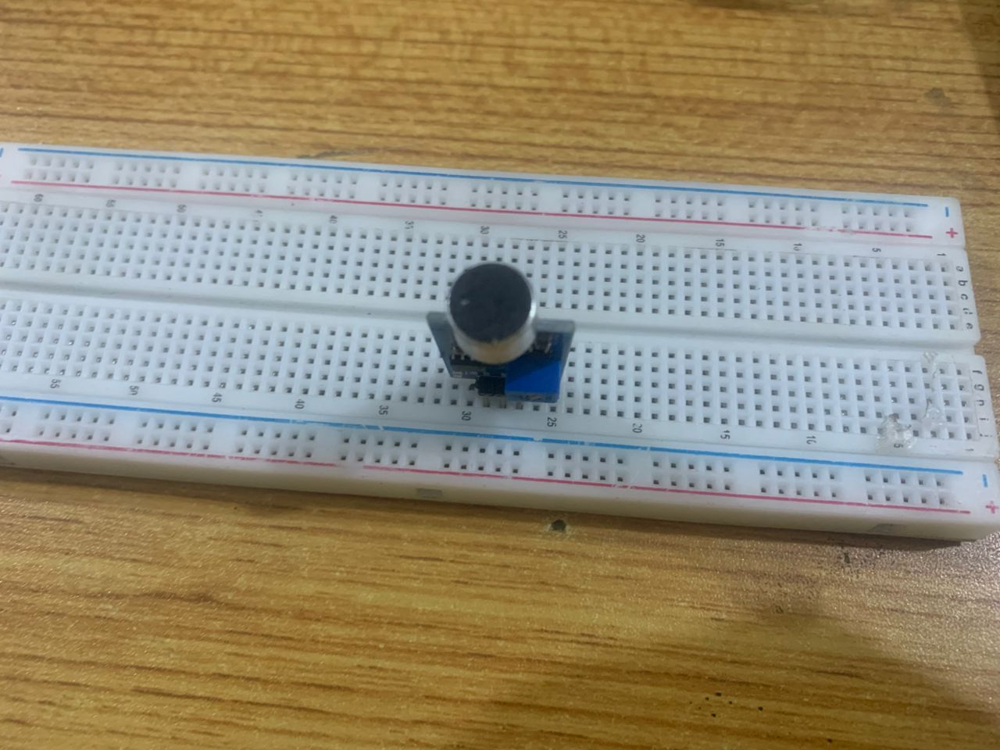
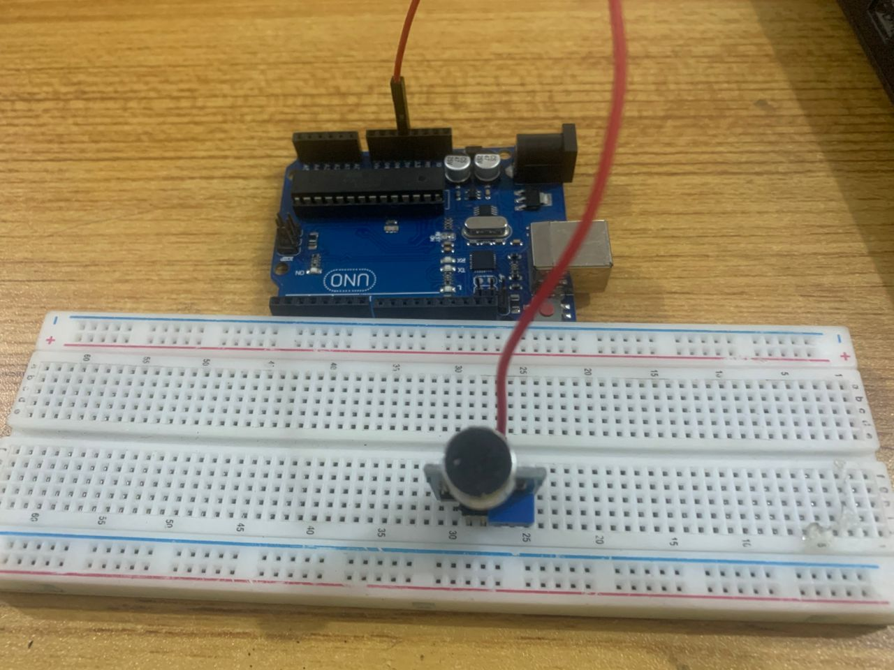
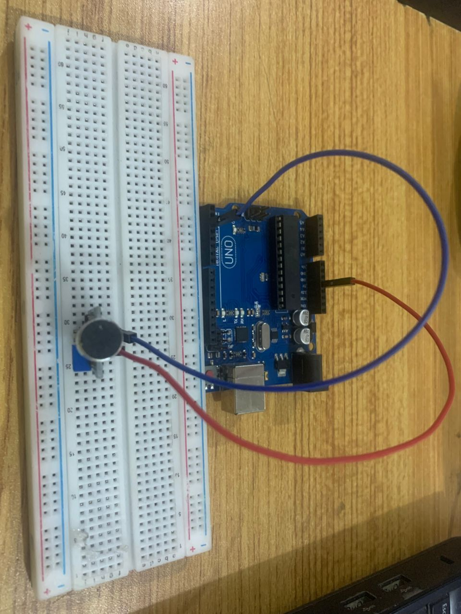
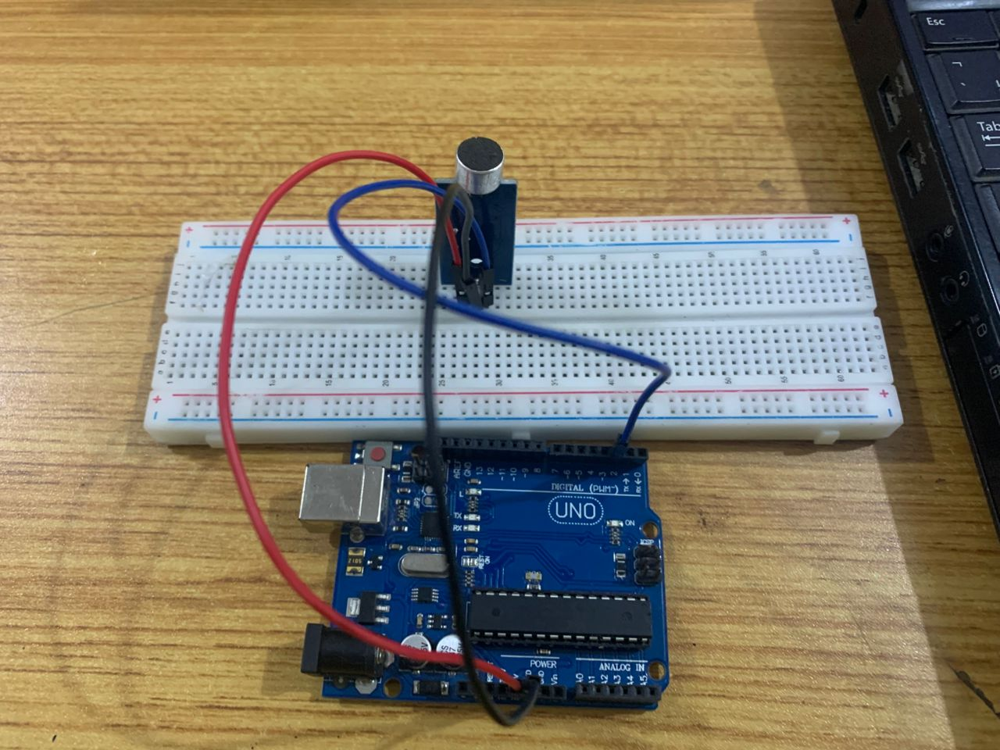
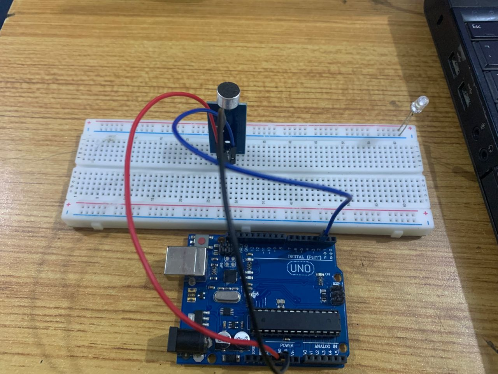
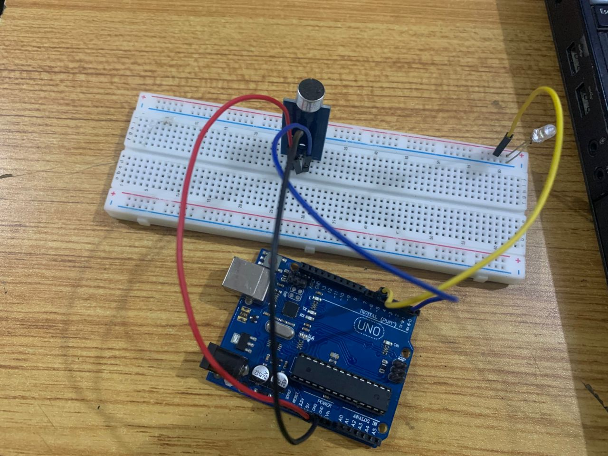
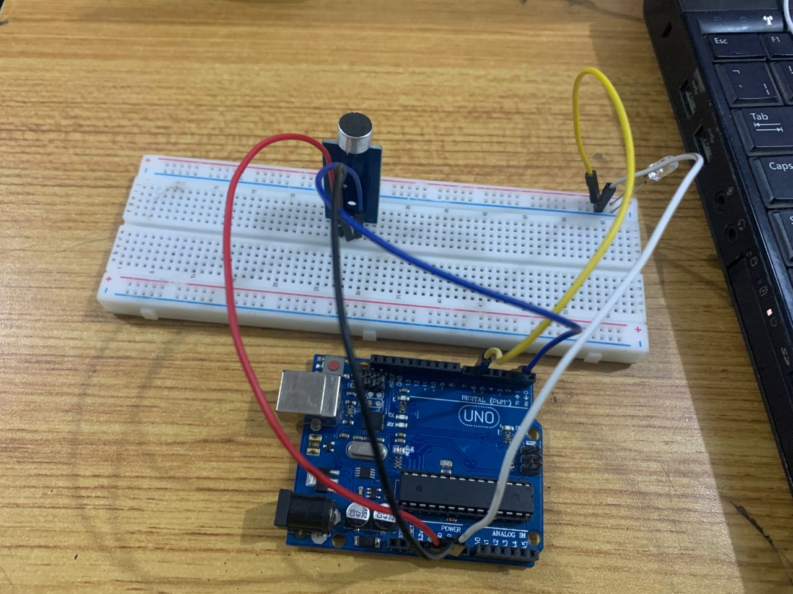
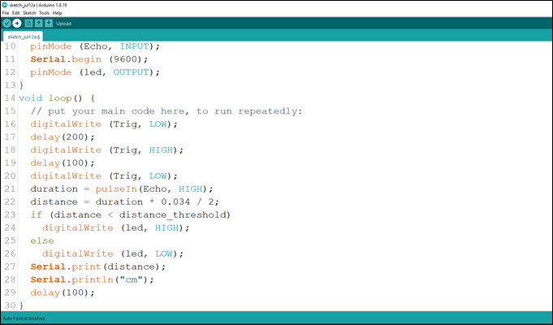

# Project 2.001: SMART CLAP DEVICE Control

| **Description** | Double LED ON is a simple project that guides you in turning on two LEDs at the same time.                                                                                                                              |
| --------------- | ----------------------------------------------------------------------------------------------------------------------------------------------------------------------------------------------------------------------- |
| **Use case**    | This project finds utility in basic signaling setups. For instance, it could be applied in an easier and basic lighting system, where two LEDs turning on together provide ample brightness when someone enters a room. |

## Components (Things You will need)

|  |  |  |  |  |  |
| --------------------------------------- | --------------------------------------------------- | ----------------------------------------------------------- | ----------------------------------------------------- | ------------------------------------------------------ | --------------------------------------------------------- |

## Building the circuit

Things Needed:

- Arduino Uno = 1
- Arduino USB cable = 1
- White LED = 1
- Sound sensor = 1
- Red jumper wires = 1
- Blue jumper wires = 1

## Mounting the component on the breadboard

### Things needed:

- Sound Sensor = 1
- Breadboard =1
-     White LED = 1

**Step 1:** Take the breadboard, insert and the sound sensor into the connectors on the breadboard.

.

## WIRING THE CIRCUIT

### Things Needed:

- Red male-to-male jumper wire: 1
- Black male-to-male jumper wire: 1
- White male-to-male jumper wire: 1
- Blue male-to-male jumper wire: 1

**Step 1:** Connect one end of red male-to-male jumper wire to VCC of the sound sensor on the breadboard and the other end to 5V on the Arduino UNO.

.

**Step 2:** Connect one end of the blue male-to-male jumper to DO of the sound sensor on the breadboard and the other end to pin number 2 on the Arduino UNO.

.

**Step 3:** Connect one end of the black male-to-male jumper to Gnd of the sound sensor on the breadboard and the other end to GND on the Arduino UNO.

.

**Step 4:** insert the white LED into the horizontal connectors on the breadboard beside the ultrasonic sensor and take note of where the positive pin (long pin) is and where the negative pin (short pin) is as shown in the picture below.

.

**Step 5:** Connect one end of the yellow male-to-male jumper wire to the positive pin of the LED and the other end to digital pin 6 on the Arduino Uno board as shown in the picture below.

.

**Step 6:** Connect one end of the white male-to-male jumper wire to the negative pin of the LED and the other end to the GND pin on the Arduino Uno board as shown in the picture below.

.

## PROGRAMMING

**Step 1:** Copy and paste the code below into your Arduino IDE
```
// Define pins
const int soundSensorPin = 2;
const int ledPin = 6;

void setup() {
  pinMode(soundSensorPin, INPUT); // Set sound sensor as input
  pinMode(ledPin, OUTPUT);        // Set LED as output
  Serial.begin(9600);             // Initialize Serial Monitor
}

void loop() {
  int sensorValue = digitalRead(soundSensorPin); // Read sound sensor value

  if (sensorValue == HIGH) {                     // If sound is detected
    digitalWrite(ledPin, HIGH);                 // Turn ON the LED
    delay(500);                                 // Keep LED ON for 500ms
  } else {
    digitalWrite(ledPin, LOW);                  // Turn OFF the LED
  }
}
```

.

**Step 2:** Save your code. _See the [Getting Started](../../../../README.md#getting-started) section_

**Step 3:** Select the arduino board and port _See the [Getting Started](../../../../README.md#getting-started) section:Selecting Arduino Board Type and Uploading your code_.

**Step 4:** Upload your code. _See the [Getting Started](../../../../README.md#getting-started) section:Selecting Arduino Board Type and Uploading your code_

## CONCLUSION

To sum up, the one LED blink project demonstrates a foundational concept in electronics and programming. Through this simple yet illuminating endeavor, learners grasp the essentials of hardware interfacing, coding logic, and timing control. This project lays the groundwork for more advanced explorations while showcasing the transformative power of just a single LED, sparking curiosity and creativity in the world of DIY electronics.
